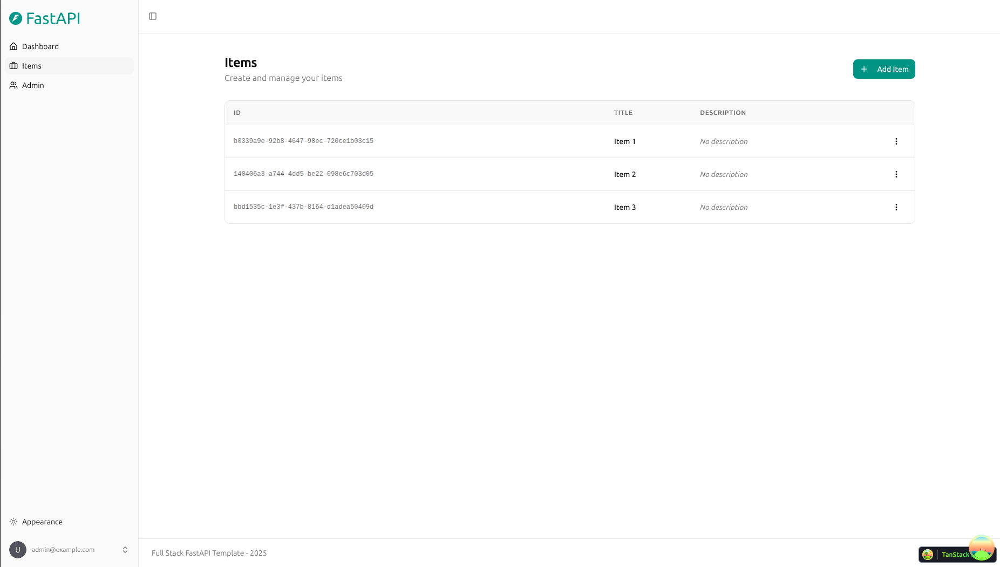

# LightSQL

基于 Full Stack FastAPI Template 建设的内部智能问数系统。

- [完整系统启动教程](docs/系统启动教程.md)：全新 Docker 一次启动、已有本机环境启动、首次业务配置、外部接入验证、重启升级与排错。

- [系统建设规划](docs/智能问数系统建设规划.md)：调研、架构、语义层、模型与隐私策略、实施路线。
- [模块建设与验收](docs/模块建设与验收.md)：模块状态、当前演示入口、启动方法和验收清单。
- [外部系统接入开发与使用](docs/外部系统接入开发与使用.md)：嵌入问数界面、应用认证、开放 API、身份映射、SDK、部署与验证。管理入口 `/integrations`。

当前进度：M01–M06 已通过用户验收。M07「质量评测与运维交付」已完成首轮工程实现：长期加密反馈与审核、回归题关联、题集和结果评分、模型/脱敏对照记录、运行监控与备份恢复工具；186 项模块回归、隔离浏览器五题流程及元数据库恢复演练通过。真实业务 120 题、模型与脱敏实验及内网试运行尚待完成，M07 未标记整体验收。详见 [M07 功能与验收边界](docs/M07质量评测与运维交付.md) 和 [运维手册](docs/M07运维手册.md)。管理员入口：[质量与运维](http://127.0.0.1:8000/quality)。当前建设范围为 PostgreSQL、MySQL、Oracle；达梦与人大金仓兼容继续暂缓。

2026-09-07 继续推进：共享查询调度现为全局 5、每源 2、每人 1 项，排队满 30 秒过期；运维页显示占用。192 项模块回归、25 项 × 三库合成结果核对通过，两个独立 Worker 的 20 秒预算测试 10/10 成功。默认 15 秒预算的突发超时记录及生产容量边界见 [三库回归与并发验证](docs/M07三库回归与并发验证.md)。

2026-09-07 第三轮：新增42项权限/外发专项及销售经营合成120题，100条参考SQL在本地PostgreSQL核对通过，题集已导入质量页；最终236项模块回归通过。默认15秒预算三轮30项查询全部成功，阶段计时提示子进程启动与排队开销明显；生产容量仍待验证。资料、复现与边界见[专项与销售题集记录](docs/M07安全专项与销售题集.md)。

2026-09-07 DuSQL 测试：已对用户提供的2,482道开发题完成SQL兼容性核验，800道可执行PostgreSQL参考题结果一致；经授权固定调用模型17次，14题与参考一致、2题结果不同、1题编译拒绝，无重试。数据质量问题、调用用量与完整边界见 [DuSQL测试报告](docs/DuSQL测试报告.md)。

以下保留基础框架的说明。

## Technology Stack and Features

- ⚡ [**FastAPI**](https://fastapi.tiangolo.com) for the Python backend API.
  - 🧰 [SQLModel](https://sqlmodel.tiangolo.com) for the Python SQL database interactions (ORM).
  - 🔍 [Pydantic](https://docs.pydantic.dev), used by FastAPI, for the data validation and settings management.
  - 💾 [PostgreSQL](https://www.postgresql.org) as the SQL database.
- 🚀 [React](https://react.dev) for the frontend.
  - 🧩 Built into the backend application and served by FastAPI on the same domain as the API.
  - 💃 Using TypeScript, hooks, [Vite](https://vitejs.dev), and other parts of a modern frontend stack.
  - 🎨 [Tailwind CSS](https://tailwindcss.com) and [shadcn/ui](https://ui.shadcn.com) for the frontend components.
  - 🤖 An automatically generated frontend client.
  - 🧪 [Playwright](https://playwright.dev) for end-to-end testing.
  - 🦇 Dark mode support.
- ☁️ [FastAPI Cloud](https://fastapicloud.com) for deployment.
- 🐋 [Docker Compose](https://www.docker.com) for local services and self-hosted deployment.
  - 📞 [Traefik](https://traefik.io) as a reverse proxy with automatic HTTPS.
- 🔒 Secure password hashing by default.
- 🔑 JWT (JSON Web Token) authentication.
- 📫 Email-based password recovery.
- ✉️ [React Email](https://react.email) for email templates.
- 📬 [Mailpit](https://mailpit.axllent.org) for local email testing during development.
- ✅ Tests with [Pytest](https://pytest.org).
- 🏭 CI (continuous integration) and CD (continuous deployment) based on GitHub Actions.

### Dashboard Login

### Dashboard - Admin

### Dashboard - Items

### Dashboard - Dark Mode

### React Email Templates

### Mailpit - Local Email Testing

### Interactive API Documentation

## How to Use It

Click the **Use this template** button at the top of this page to create a new repository.

## Backend Development

Backend docs: [backend/README.md](./backend/README.md).

## Frontend Development

Frontend docs: [frontend/README.md](./frontend/README.md).

## Deployment

FastAPI Cloud deployment: [deployment.md](./deployment.md).

Self-hosted deployment with Docker Compose: [deployment-docker-compose.md](./deployment-docker-compose.md).

## Development

General development docs: [development.md](./development.md).

This includes the local FastAPI and Vite workflow, Docker Compose services, `.env` configuration, and more.

## Release Notes

Check the file [release-notes.md](./release-notes.md).

## License

The Full Stack FastAPI Template is licensed under the terms of the MIT license.
