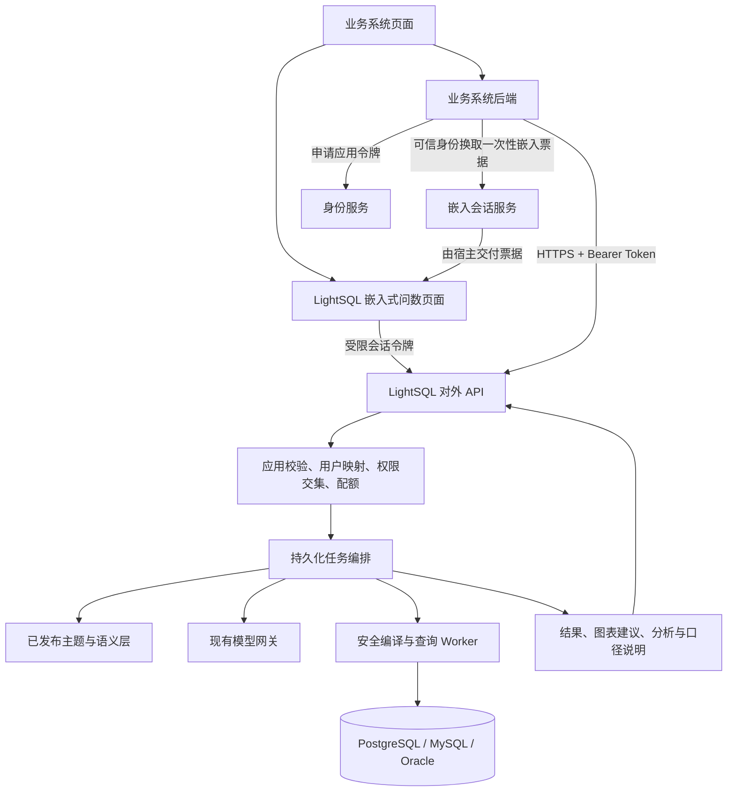

# LightSQL 外部系统接入方案：嵌入式问数界面与开放 API

日期：2026-09-07。状态：设计方案；双入口首版已实现，实际接口、验证结果及与原规划的差异见[开发交付与使用](外部系统接入开发与使用.md)。本文保留原设计范围和估算，不作为逐项实现声明。

目标：同时支持两种接入方式：（一）其他系统嵌入 LightSQL 提供的问数对话界面，实际问数仍由 LightSQL 完成；（二）其他系统通过 API 调用 LightSQL，自行组织业务交互和结果展示。目标系统技术栈、身份体系和调用规模尚未提供，本方案以单个内网业务系统试点为基础。本版按用户补充的双入口需求修订，替代此前仅开放 API 的范围与估算。

## 1. 建议方案

建设“一套问数服务、两种接入入口”。在现有 FastAPI 中增加独立的 `/api/integration/v1` 对外接口，复用现有语义层、模型网关、安全编译器和查询 Worker；增加独立 `/embed/ask` 页面，复用现有对话、表格、图表、分析和来源说明组件。

| 接入方式 | 界面由谁提供 | 接入方负责 | 适用场景 |
|---|---|---|---|
| 嵌入式问数 | LightSQL | 放置 iframe/浮窗容器、对接身份、提供默认主题等上下文 | 快速在 OA、ERP、门户增加问数入口 |
| 开放 API | 接入系统 | 后端调用、交互编排、结果展示 | 自定义助手、看板、报表和业务流程 |

两种方式共用应用登记、可信用户映射、权限、任务、审计与限额。嵌入页面同样使用受限集成会话调用公共能力，不以内部管理员登录态调用接口。

首期公共接口采用 HTTPS + REST/JSON + 持久化异步任务 + 状态轮询；对外 SSE 作为后续可选增强。嵌入页面先通过轮询展示真实阶段，再按需要接入 SSE。应用凭证由接入方后端保管。



首期继续使用现有部署和 PostgreSQL 元数据库；不因增加 API 引入 Redis、消息中间件或微服务拆分。新增任务编排进程可以复用后端镜像单独运行。

## 2. 已有能力与改造缺口

以下以当前代码为依据；数据库范围沿用项目当前约定，仅 PostgreSQL、MySQL、Oracle。

| 能力 | 当前实现 | 接入改造 |
|---|---|---|
| 用户鉴权 | `/api/v1/login/access-token` 签发内部用户 JWT，依赖内部 User | 新增应用身份、令牌校验与外部身份映射 |
| 问数页面 | `/ask` 使用内部工作台布局，依赖 localStorage 中的内部登录令牌 | 抽取可复用问数组件，新增独立嵌入布局、集成认证上下文和宿主通信 |
| 结构化查询 | `/api/v1/queries/` 提交任务，支持读取状态、结果和取消 | 封装稳定契约，增加应用隔离、幂等和配额 |
| 自然语言问数 | `/api/v1/assistant/conversations` 及轮次、执行接口 | 对外封装“提问→规划→查询”，隐藏内部多步调用 |
| 模型规划与分析 | 接口内部等待模型响应；规划有并发限制 | 纳入持久化任务，提交接口快速返回 |
| 结果分析 | 分析与会话轮次关联，计算精确事实后调用模型 | 抽取按授权结果分析的服务，兼容结构化查询结果 |
| 数据权限 | 已发布主题、成员、指标/维度、探索字段、行范围；结果归属内部用户 | 增加应用维度与用户维度共同隔离，复用并扩展权限解析 |
| 进度 | 已有会话 SSE，返回当前快照，最长约 25 秒后重连 | 首期轮询；后续封装对外 SSE，不承诺历史事件补放 |
| 接口文档 | FastAPI OpenAPI 与生成的前端客户端 | 提供独立的集成 OpenAPI、错误码、示例与版本策略 |

不能仅将应用请求转换成管理员账号调用：现有权限、结果归属和幂等主要绑定 `actor_id`，必须补齐应用维度。当前内部提交模型也接受 `SqlPlan`，对外首期应明确收窄为标准指标计划或自然语言输入。

## 3. 首期开放范围

| 能力 | 接入方输入 | 返回内容 | 典型用途 |
|---|---|---|---|
| 可用主题与目录 | 已认证的身份 | 授权主题、指标、维度、类型、单位 | 查询条件选择器 |
| 标准指标查询 | 主题、指标、维度、过滤、时间范围 | 表格、执行信息、语义版本 | 经营看板、固定报表 |
| 自然语言问数 | 主题、问题，可选会话 | 澄清问题或查询结果、图表建议、口径来源 | 业务系统内的问数入口 |
| 结果分析 | 本应用/本主体有权读取的任务结果 | 事实、引用事实的分析、适用范围 | 自动生成结果说明 |
| 任务管理 | 任务 ID | 状态、结果、取消状态、到期时间 | 长耗时调用与恢复 |

固定看板优先使用标准指标查询，减少每次刷新时调用模型及生成口径的不确定性。自然语言问数初期默认 `metrics` 模式；`auto` / `explore` 作为单独授权能力开放，继续受逐列授权与行范围约束。

首期包含专用嵌入页面和免重复输入账号的身份接入；不包含任意 SQL 直传、任意外部数据上传分析、跨数据源 JOIN、写库操作、大批量导出或企业身份平台重建。分析仅针对授权查询的实际返回行；返回结果截断时必须同时返回范围说明。

### 3.1 嵌入式问数界面

首期选择 iframe，并提供很薄的 JavaScript 接入 SDK 管理装载、尺寸、身份续期与消息事件。SDK 内部仍装载 LightSQL 托管页面，避免每个业务系统分别维护 React/Vue 问数组件。当前 `/ask` 含工作台登录与外围布局，不能直接当作完整嵌入方案交付。

**界面形态**：同一个页面支持业务页面中的固定面板、右侧抽屉、悬浮按钮打开的对话框。保留输入、多轮会话、澄清、任务进度、取消、表格/图表、分析及口径来源；移除管理侧栏、数据源配置与模型设置等入口。

**可配置项**：默认或固定主题、标题、浅深色主题、欢迎语、预置问题、是否显示会话列表。固定主题由后端会话范围限制；隐藏按钮或传 URL 参数不能构成授权。默认问题先填入输入框，用户发送后才执行，页面挂载或刷新不自动产生模型调用。

**免重复登录流程（拟实现）**：

1. 用户已登录业务系统。业务后端校验自己的用户会话，携带应用认证及可信用户/委托证明向 LightSQL 申请嵌入票据；固定权限展示场景可以使用预先登记的应用主体。
2. LightSQL 校验应用、主体和数据范围，签发短时、一次性票据。建议票据有效期 60 秒，绑定应用、主体、允许父页面来源、主题范围及随机会话标识。
3. 父页面加载 `/embed/ask?client_id=<公开应用标识>`，该地址不携带令牌、票据、问题或个人信息。iframe 生成本次加载的随机挑战值并通过 `ready` 消息通知宿主，宿主申请的票据还应绑定此挑战。
4. 父页面通过校验来源的 `postMessage` 将票据交付给指定 iframe；iframe 向 LightSQL 同源端点提交票据与挑战值，服务端原子消费票据并返回短期、仅限集成问数的会话令牌。服务端身份信任依据是已验证的应用/用户证明，不是客户端自报的 parent origin。
5. 会话令牌仅保存在 iframe 内存中，由独立 API 客户端注入 Bearer；不复用内部工作台的 localStorage 令牌，不向父页面回传会话令牌。刷新或即将过期时，通过宿主后端重新获取票据，恢复原会话仍需重新校验归属和权限。
6. 宿主退出或切换用户时，其后端撤销关联嵌入会话，SDK 清空并重建 iframe。LightSQL 每次请求检查嵌入会话是否有效；仅清除前端显示不足以撤销已签发的令牌。

此设计不依赖跨站第三方 Cookie 自动共享登录态；浏览器对第三方 Cookie 的限制需要纳入嵌入兼容性验证。[浏览器依据：MDN](https://developer.mozilla.org/en-US/docs/Web/Privacy/Guides/Third-party_cookies)

**宿主通信协议**：SDK 暴露 `mount`、`open`、`close`、`setContext`、`destroy`；事件包括 `ready`、`resize`、`auth_required`、`task_completed`、`error`。消息均携带协议版本、实例 ID 与请求 ID，双向检查精确 `origin`、`event.source`、消息结构和当前实例；发送指定 `targetOrigin`，不用 `*`。默认只通知任务 ID 与状态，不将结果明细自动发送给父页面；需要数据的宿主后端通过同一应用和主体的 API 领取。[通信依据：MDN postMessage](https://developer.mozilla.org/en-US/docs/Web/API/Window/postMessage)

**嵌入来源控制**：每个应用登记允许的完整源（协议、域名、端口）；仅嵌入入口响应允许这些来源的 CSP `frame-ancestors`，管理页面保持禁止第三方嵌入。父系统 CSP 也要允许加载 LightSQL；核对反向代理的 `X-Frame-Options` 不与嵌入策略冲突。`frame-ancestors` 是页面响应头，不能用 HTML meta 代替；CORS 与 iframe 嵌入许可分别配置。[依据：MDN frame-ancestors](https://developer.mozilla.org/en-US/docs/Web/HTTP/Reference/Headers/Content-Security-Policy/frame-ancestors)

SDK 装载的 iframe 采用必要的最小权限集合，初期允许脚本及保留 LightSQL 自身源以调用同源 API，不开放顶层导航或弹窗。推荐独立 LightSQL 源；父站嵌套 iframe、严格 COEP 策略等环境在联调时单独验证。浏览器必须能访问 LightSQL 地址；若只有业务后端可达，API 模式仍可用，嵌入模式需补充受控浏览器访问入口。

嵌入页面刷新、网络恢复或组件重复挂载都只恢复状态，不自动重新提交问题。业务上下文（如当前客户、订单号）是待校验的查询条件，不是可信权限；模型外发仍遵守主题和应用配置。

## 4. 应用认证与数据权限

### 应用身份

每个接入系统登记独立 `client_id`，配置启停状态、允许能力、主题范围、调用限额和凭证轮换规则。

优先复用企业现有 OAuth 2.0 身份服务，以 Client Credentials 模式签发应用访问令牌；无现成身份服务时，在 LightSQL 增加最小应用令牌签发模块。Client Credentials 适用于能够保护凭证的后端应用，令牌交换及 API 均使用 HTTPS。[依据：RFC 6749](https://www.rfc-editor.org/rfc/rfc6749.html)

校验令牌签名、签发方、受众、有效期及 scope；建议有效期 10–15 分钟，具体值在接入契约中确定。每次请求仍检查应用启停与当前授权，停用应用后已有令牌也不能继续领取结果。受众限定为 LightSQL，并限制令牌权限。[依据：RFC 9700](https://www.rfc-editor.org/rfc/rfc9700.html)

### 两种调用主体

1. **应用固定权限**：用于固定报表、后台任务。应用映射至专用、非管理员执行主体，按主题配置最小数据范围。此模式没有终端用户数据隔离语义，不能用来承载不同用户各自权限的交互问数。
2. **代表用户查询**：用于 ERP、OA 等系统中的个人问数。使用可信身份服务签发且面向 LightSQL 的用户/委托证明，并绑定调用应用；服务端将可信的外部身份映射为 LightSQL 内部主体。Client Credentials 令牌本身只证明应用身份，不能证明用户身份。

身份映射键建议使用 `(issuer, client_id, external_subject)`，租户/组织取自经验证的身份声明或后台维护映射，不接受请求正文随意指定的 `user_id`、`tenant_id`、角色或行权限。身份暂未打通时只开放固定权限试点。

最终授权取以下交集：**应用可用能力及主题/数据范围 ∩ 执行主体的指标、字段和行权限 ∩ 当前发布版本及数据源可用范围**。业务过滤条件只能进一步缩小范围。

会话、任务、结果、分析、幂等记录均绑定 `client_id + principal_id`；两个应用即使映射到同一内部用户，也不能互读任务。执行前、执行期间、落库前和领取结果时复核权限；撤权或发布版本失效后拒绝读取。

## 5. 对外接口草案

以下路径与字段均为拟新增契约，当前不可直接调用。公共前缀为 `/api/integration/v1`；身份服务令牌端点单独约定。

| 方法与路径 | 用途 |
|---|---|
| `GET /topics` | 列出本应用与主体有权使用的主题 |
| `GET /topics/{topic_id}/catalog` | 返回可查询的业务目录，过滤内部管理字段 |
| `POST /queries` | 提交结构化指标查询，返回 202 |
| `POST /answers` | 提交自然语言问题或继续会话，返回 202 |
| `GET /tasks/{task_id}` | 获取当前阶段、状态、澄清选项、关联会话及版本 |
| `GET /tasks/{task_id}/result` | 获取查询结果、可用分析和口径说明 |
| `POST /tasks/{task_id}/analysis` | 对已有授权结果提交分析子任务，返回 202 |
| `POST /tasks/{task_id}/cancel` | 申请取消，返回真实取消状态 |
| `POST /embed/tickets` | 业务后端凭应用认证与可信主体申请一次性票据 |
| `POST /embed/sessions` | iframe 使用票据与挑战值换取受限会话；独立校验票据，不依赖已有 Bearer |
| `DELETE /embed/sessions/{session_id}` | 宿主后端或该会话撤销嵌入访问，校验归属 |

自然语言请求示例（占位值需替换）：

```http
POST /api/integration/v1/answers
Authorization: Bearer <access_token>
Idempotency-Key: <unique-request-key>
Content-Type: application/json

{
  "topic_id": "<published-topic-uuid>",
  "question": "2026年8月各区域净销售额是多少？",
  "mode": "metrics",
  "include_analysis": true
}
```

服务端提交响应示例：

```json
{
  "task_id": "<task-uuid>",
  "conversation_id": "<conversation-uuid>",
  "status": "queued",
  "request_id": "<trace-request-id>",
  "status_url": "/api/integration/v1/tasks/<task-uuid>"
}
```

继续会话时提交 `conversation_id`、`expected_revision`；澄清回答携带服务端给出的澄清引用与选项 ID。会话主题不可由追问切换，不同问题使用不同幂等键。

结果契约包含 `columns`、`rows`、`row_count`、`truncated`、`queried_at`、`expires_at`、`semantic_version`、`evidence`，以及可选 `chart`、`analysis`、`warnings`。列携带稳定 ID、名称、类型、单位、时区；数字沿用现有十进制字符串协议，日期使用 ISO 表示，保留布尔和 NULL。图表返回类型及列映射，由接入方渲染。业务数据更新水位当前未知，不将查询完成时间冒充数据更新时间。

SQL、物理表名、连接信息及策略细节不进入首期公共返回结构。需要 SQL 审计时通过内部管理权限另行查看。

## 6. 任务、重试与异常约定

- 提交事务中保存输入摘要、任务归属和幂等记录，成功入库后返回 202；模型调用不占用提交请求的等待时间。
- 主要状态：`queued → planning → querying → analyzing → succeeded`；另含 `needs_clarification`、`failed`、`cancelling`、`cancelled`、`cleanup_pending`、`expired`。结构化查询跳过规划，无分析请求则跳过分析。
- 查询成功但可选分析失败时保留表格，任务结果注明 `analysis.status=failed` 及原因；单独重试分析不得重跑已完成 SQL。
- 幂等范围为 `(client_id, principal_id, operation, Idempotency-Key)`；同键同输入返回原任务，同键不同输入返回 409。幂等摘要覆盖会话、版本及分析选项，并映射出稳定的内部请求 UUID。
- 幂等记录首期建议保留 90 天摘要，敏感载荷沿用短期留存。原结果到期后相同键返回原任务的到期状态，不静默生成新查询；超过记录窗口不承诺去重，SDK 必须要求新操作使用新键。
- 持久化每一阶段与内部任务关联，Worker 重启先对账后推进；SQL 状态不确定沿用 `cleanup_pending`。模型调用存在外部处理成功但本地未收到响应的情况，不承诺跨模型服务的严格只执行一次；默认不自动重发状态不明的付费调用。
- 轮询建议从 1 秒开始退避到 5 秒，并遵循 `Retry-After`。提交超时后以原幂等键重试，不能生成新键反复提问。令牌过期后重新取得令牌，继续读取原任务。
- SQL 执行预算、队列等待期限、模型超时和整个任务截止时间分开配置。现有 SQL 默认 15 秒与模型配置默认 45 秒均不构成整个问数接口的完成时限。
- 取消请求不直接等于查询已停止；在底层确认前保持 `cancelling` 或 `cleanup_pending`。模型不能确认取消时禁止后续查询并丢弃迟到内容，不声称外部模型调用已经停止计费。

统一错误结构为 `code`、`message`、`request_id`、`retryable`。约定 401 认证失败、403 权限不足、404 对象不存在或不属于调用方、409 幂等/会话冲突或结果尚未就绪、410 结果过期、422 参数不支持、429 超额、503 服务不可用。异步执行错误同时体现在任务状态中；`needs_clarification` 属于业务状态，不作为服务器错误。

## 7. 容量、数据与运维

当前配置为 SQL 全局最多 5 项执行、每源 2 项、每用户 1 项；队列等待上限 30 秒。模型规划当前另有全局 4 项、每用户 1 项限制。真实生产容量尚未验证。

首期增加应用级请求速率、在途任务数、模型调用量与用量统计，所有应用及原工作台共同遵守现有底层额度。一个固定应用主体仍受到每用户 1 项执行限制；不能靠创建多个身份绕过配额。配额具体数值在试点压测后确定。

结果沿用默认 100 行、最多 1000 行、结果行载荷最多 2 MB、单文本单元格最多 16 KB；这些限制不代表扫描量上限。当前会话与结果约 24 小时有效，任务摘要/审计按现有 90 天策略衔接。所有结果与分析接口加 `Cache-Control: no-store`。

审计记录应用、可信主体、主题、权限/语义版本、请求/任务 ID、执行状态、耗时和模型用量；默认不把密钥、问题全文或结果明细写入普通日志。复用现有模型外发与脱敏配置，并在应用授权中单独控制模型规划、探索和结果分析能力。已交付给外部系统的数据无法由 LightSQL 远程撤回，接入契约需约定对方的缓存、访问控制和留存期限。

部署网关向集成 API、嵌入页面和必要静态资源放行所需路径；数据源、模型密钥、主题发布、质量管理等接口维持管理范围。服务端到服务端调用无需放宽浏览器 CORS；嵌入页面在 LightSQL 自身源内调用 API，也不要求宿主直接跨源访问 API。首期不增加结果 Webhook；后续如需要，再设计回调地址登记、签名、防重放及至少一次通知去重。

## 8. 代码与数据改造范围

| 位置（相对项目根目录） | 计划改造 |
|---|---|
| `backend/app/api/routes/integration.py`（新增） | 公共接口与独立响应模型 |
| `backend/app/modules/integration/`（新增） | 应用、身份映射、权限解析、幂等、任务编排与审计 |
| `backend/app/api/deps.py` | 增加集成鉴权依赖，内部用户登录保持兼容 |
| `backend/app/api/main.py` / `backend/app/main.py` | 注册独立公共前缀与错误处理、响应头 |
| `backend/app/modules/assistant/` | 将现有规划和分析服务接入任务调度，保留工作台契约 |
| `backend/app/modules/query/` | 复用安全执行，扩展应用限制与有效权限复核 |
| `backend/app/alembic/versions/` | 新增应用、身份、任务和审计迁移 |
| 管理端与 `docs/` | 最小应用登记/停用/授权页面，公共 OpenAPI 与调用示例 |
| `frontend/src/components/Assistant/` | 抽取问数核心组件，注入内部/集成 API 与认证上下文；避免读全局内部令牌 |
| `frontend/src/routes/embed/ask.tsx`（新增，按路由约定落位） | 独立嵌入布局与认证状态，支持面板/抽屉尺寸 |
| 嵌入 SDK 与演示宿主页面（新增） | 挂载与销毁、来源验证、身份更新、主题配置和可访问性 |

建议新增 `IntegrationClient`、`ExternalIdentityMapping`、`IntegrationTask`、`IntegrationAudit`、`EmbedTicket`、`EmbedSession`。票据仅存摘要、有效期、绑定范围及消费状态；嵌入会话可撤销并绑定外部登录会话的不可逆关联标识，不保存宿主的原始会话凭证。应用授权可独立建表；幂等唯一键和输入摘要可存于任务表。任务关联现有会话/轮次/查询任务，避免复制一套查询执行结果。应用机密仅保存验证所需摘要；凭证轮换支持短暂双凭证窗口。

现有 User/QueryGrant 适合作为首期执行主体，但 QueryPolicy 当前最多 200 条成员授权；外部用户达到该规模前，需要将授权规范化、支持组织/组映射，不能宣称当前结构已经支持大规模多租户平台。

## 9. 实施顺序与验收

按一名熟悉项目的全栈工程师主导、接入方配合、复用已有身份设施估算，双入口方案总计约 **16–24 个工作日**；这是工程量估算，外部联调等待、复杂身份系统对接和生产容量整改另计。原 12–18 天估算只涵盖 API 范围。

| 阶段 | 工作与交付 | 估算 |
|---|---|---|
| 1. 共用接入底座 | 选定试点主题，冻结权限模式；应用认证、主体映射、结构化查询、结果领取、隔离与基础审计 | 3–5 天 |
| 2. 问数与分析 API | 持久化编排、自然语言提问、澄清/追问、可选分析、幂等、取消与故障恢复 | 5–7 天 |
| 3. 嵌入式问数 | 抽取问数组件、独立嵌入页面、票据与会话撤销、SDK 和宿主演示 | 4–6 天 |
| 4. 双入口联调 | 配额和管理入口、接入文档、跨源/身份/权限回归、目标环境压测和小流量试点 | 4–6 天 |

按共用底座、问数 API、嵌入界面的依赖顺序实施；第一批业务用户可以从嵌入入口试用，API 同步作为可交付能力。面向不同用户的交互问数必须完成身份映射和用户隔离后才开放。

验收至少覆盖：

1. 同一授权主体通过内部工作台与公共 API 查询，结果、口径及行范围一致。
2. 不同应用、用户、组织的数据及会话隔离；应用停用、用户撤权后，旧结果和分析不能继续领取。
3. 重复请求、超时重试和并发同键不重复创建任务；同键改参数返回 409。
4. 问题需要澄清时不执行 SQL；会话版本冲突可恢复；分析失败仍能获得成功的查询数据。
5. Worker 重启、令牌过期、模型超时、SQL 超时、取消与不确定清理具有可解释的真实状态。
6. 精确金额、NULL、时间、空结果、结果截断和过期符合契约；无越权字段或内部敏感信息泄露。
7. 在目标环境按商定负载记录排队时间、端到端 P50/P95、错误率、源库负载及模型用量，再确定调用配额与服务目标。
8. 原有工作台和查询模块相关回归通过；灰度应用独立开关可关闭，停止新接入不影响原系统使用。
9. 嵌入页面在允许来源可用，非允许来源被拒绝；伪造消息、票据重放、过期票据和跨实例消息不能建立会话。
10. 验证禁用第三方 Cookie、刷新、重复挂载、多个嵌入实例、用户切换及退出：不串用户、不重复执行；撤销后旧令牌不能读取数据。
11. 面板/抽屉/浮窗在目标浏览器与约定尺寸下正常展示，键盘与焦点可用；底层模型配置和查询数据源在两种接入方式中保持一致。

## 10. 落地前待补充信息

- 第一个接入系统的名称、后端技术栈及具体业务页面/后台任务。
- 嵌入形式（页面面板/抽屉/浮窗）、宿主域名、浏览器访问 LightSQL 的网络条件；嵌入和 API 是否使用同一应用身份。
- 固定应用数据权限，还是每位用户独立权限；是否已有可信身份服务和稳定用户/组织标识。
- 首批主题、指标、是否允许自由探索，以及是否需要自动生成分析。
- 预计使用人数、峰值同时查询数、可接受等待时间、部署网络与结果留存要求。

这些信息用于收敛身份模式与试点验收指标；整体接口分层和复用方向可以先按本方案推进设计。

## 11. 项目依据

- `backend/app/api/deps.py`：当前内部用户 Bearer/JWT 鉴权。
- `backend/app/api/routes/assistant.py`、`backend/app/modules/assistant/models.py`、`service.py`、`analysis.py`：会话、规划、执行与分析契约。
- `backend/app/api/routes/queries.py`、`backend/app/modules/query/models.py`、`service.py`：查询任务、权限与结果协议。
- `backend/app/core/config.py`、`docs/M07三库回归与并发验证.md`：当前并发参数与生产容量边界。
- `docs/M05自由问数调整.md`、`docs/M06问数工作台与解释.md`：探索范围、事实分析、来源与 SSE 行为。
