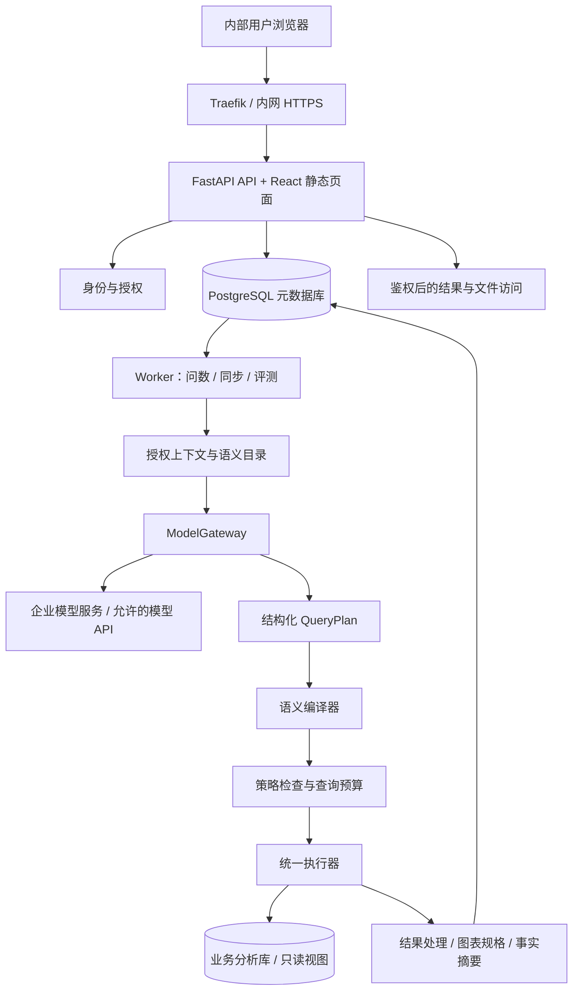
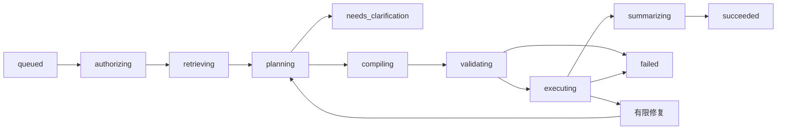

# LightSQL 智能问数系统建设规划

版本：1.3　｜　调研日期：2026-09-04；范围更新：2026-09-07　｜　适用对象：内部系统、单人开发与维护、效果优先

本文件是建设设计，不代表相关功能已经实现。框架判断来自当前仓库，产品与技术判断来自官方文档、项目仓库及研究项目；没有进行商业产品实机测评，也没有用本企业数据进行模型测试。文中容量、工期、成本和质量指标均为规划假设或验收目标。

实施进度：2026-09-07，M01–M06 已获用户验收确认；M05 的实际调用由用户自行测试并确认正常。M07 已完成三轮工程验证，新增销售经营合成120题、42项权限/外发专项及默认15秒预算复测，最终236项模块回归通过；真实业务质量、模型/脱敏对照和内网试运行未完成。详见 [M07专项与销售题集记录](M07安全专项与销售题集.md)。模型服务继续支持智谱、DeepSeek、千问等可配置接入。

> 2026-09-07 最新范围：用户要求暂时不用兼容达梦与人大金仓，当前建设与验收只覆盖 PostgreSQL、MySQL、Oracle。以下国产库内容属于历史调研或未来备选，不构成当前交付要求。

> 同日产品方向调整：以授权数据集/表字段为基础，支持自由自然语言到 SQL、图表及分析，已发布指标作为可选口径，不作为唯一入口。已移除问句词语白名单，详见 [M05 自由问数调整](M05自由问数调整.md)。本文早期的指标限定设计以该调整为准。

> 2026-09-04 最新范围更新：按用户要求，用 Docker 补齐 Oracle 实库，并尝试达梦、人大金仓。三者均已启动并接入 M01，当前共五种数据库。国产库为限时测试环境，金仓仅验证 PG 兼容模式，达梦证书校验暂未适配；来源与边界见 [数据库扩展验证记录](数据库扩展验证记录.md)。每模块完成复查、前端演示后交用户验收，实施状态以 [模块建设与验收](模块建设与验收.md) 为准。

## 1. 建设结论

建议将 LightSQL 建设为**面向内部业务人员的可信数据问答工作台**：用户用自然语言提问，系统识别业务口径、生成受约束的查询计划、查询授权数据，并返回可核对的数字、图表、口径和来源。

推荐架构为：

**现有 FastAPI + React 框架 + PostgreSQL 元数据库 + 轻量语义层 + Pydantic AI 结构化生成 + SQLGlot 编译与检查 + 统一查询执行器 + 单个后台 Worker。**

优先选择如下路线：

1. 保留现有框架，采用模块化单体。API 与 Worker 使用同一代码库、同一镜像，以不同进程运行。
2. V1 以 MySQL、PostgreSQL、Oracle 为主线，纳入已成功启动的达梦 DM8、人大金仓 V9（PG 模式）逐项验证。五库连接测试已完成，元数据、参数绑定、方言、取消与结果一致性仍按后续模块逐库验收。先建设一个业务主题，整理约 10–20 个核心指标与 50–100 条典型问题。
3. 普通用户通过“自然语言 → 指标/维度/过滤条件 → 确定性编译 SQL”问数。指标公式、权限条件、关联关系由系统控制。
4. 将直接生成 SQL 作为后续分析员探索能力，默认关闭；未被语义层覆盖的问题先澄清或明确告知尚不支持。
5. 以指标口径、授权边界、执行结果评测和错误反馈积累质量。大模型作为可替换组件，不承担权限裁决。
6. 采用“本地业务语义与实体解析 + 经允许的外部旗舰模型 + 本地 SQL 编译、执行与结果处理”。对外保留必要业务语义，真实物理标识符和敏感实体映射留在本地，详见第 8 节。若必要语义也不能外发，则切换内部旗舰模型服务。

“技术先进”在本项目中具体体现为结构化生成、上下文按需检索、语义约束、有限重试、版本化知识、可追踪执行和持续评测。首期不引入 Kubernetes、微服务集群、独立向量数据库、通用多智能体平台，也不从训练专用模型开始。

### 1.1 建设边界与待确认事项

| 事项 | 当前依据 / 默认设计 | 对建设的影响 |
|---|---|---|
| 系统性质 | 已明确：内部系统 | 内网访问，管理员开通账号，无公开注册 |
| 维护者 | 已明确：暂时个人维护 | 服务少、依赖少、自动回归、备份可恢复 |
| 业务领域 | 尚未给定；本文使用销售经营作为示例 | 第一周替换示例指标与数据模型 |
| 数据源 | MySQL、PostgreSQL、Oracle；Docker 尝试成功后增加达梦 DM8、人大金仓 V9 PG 模式 | 五库按能力分项验收；目标版本、字符集、授权和网络模式仍需盘点；连接成功不等于问数适配完成 |
| 数据规模 | 规划为一个主题、5–20 个授权模型/视图 | 大表查询依赖已有分析库、索引或汇总视图 |
| 使用规模 | 规划为 10–50 名用户、5 个并发问数、每天 100–500 问 | 用于估算，不是性能承诺 |
| 模型外发 | 用户要求评估脱敏外发的效果，效果优先 | 推荐保留语义的外发方案；企业允许范围、账号和部署地域仍需配置，本次未发送任何实际业务数据 |
| 现有 BI / 数仓 | 尚未确认 | 如已有指标平台，优先复用，避免重复定义口径 |
| 身份系统 | 先保留现有 JWT 账号 | 有企业 OIDC 时再接入，不自建身份中心 |

需要业务侧提供的最小输入：三类数据库的版本与只读连接方式、一个业务主题、十个常用指标及口径、五十个真实问题、现有报表或参考 SQL、两类权限不同的测试账号。开发可先使用脱敏样例；三类实库验收不能用同一种数据库模拟替代。

## 2. 当前框架评估与复用方案

### 2.1 已核实的基础

调研基线为仓库提交 `4a7d024`，提交说明为 `init`。以下依据为当前文件声明，并非已安装依赖版本或运行测试结果。

| 层次 | 仓库现状 | 建设处理 |
|---|---|---|
| 后端 | FastAPI；Python 要求 `>=3.14,<4.0` | 保留；新依赖先验证 Python 3.14 安装和运行兼容性 |
| 数据访问 | SQLModel、SQLAlchemy 体系、psycopg、Alembic | 用于元数据管理；业务查询使用独立连接器与连接池 |
| 配置 | Pydantic Settings，环境变量 | 扩展模型、查询额度、密钥引用、运行模式配置 |
| 登录 | JWT、密码哈希、活跃用户校验、超级管理员 | 增加角色、主题授权及操作权限 |
| 业务模型 | `User` 与模板 `Item` | 新增问数领域模型；不把 Item 强行扩展成查询记录 |
| 前端 | React 19、TypeScript、Vite、TanStack Router/Query/Table | 保留路由、请求缓存、表格和自动生成 API 客户端 |
| UI | Tailwind CSS、shadcn/ui、深浅主题 | 建设问数工作台和治理页面 |
| 构建 | Bun、uv；前端构建产物由 FastAPI 同域托管 | 继续单镜像发布 |
| 部署 | Docker Compose、PostgreSQL 18、Traefik、Adminer | 复用；生产限制管理入口，增加 Worker |
| 工程质量 | Pytest、Playwright、GitHub Actions | 扩展真实业务回归和发布门禁 |

本地依据：[项目说明](../README.md)、[后端依赖](../backend/pyproject.toml)、[前端依赖](../frontend/package.json)、[数据模型](../backend/app/models.py)、[鉴权依赖](../backend/app/api/deps.py)、[应用入口](../backend/app/main.py)、[Docker 构建](../backend/Dockerfile)、[Compose](../compose.yml)。

### 2.2 必须补齐的差距

当前没有数据源连接管理、元数据同步、指标目录、业务知识、模型调用、问数编排、查询防护、结果图表、质量评测及问数审计。

同时有三项与本项目直接相关的模板调整：

- 当前后端暴露 `/users/signup`。内部版本应由服务端关闭公开注册，前端同步移除入口。
- 当前只有普通用户与超级管理员，不能表达“可管理系统但不可看所有经营数据”。应独立建设业务数据授权。
- 当前 Dockerfile 默认启动 4 个 API Worker。不能把问数任务与并发额度只保存在各进程内存中；任务状态、取消标记和全局限额必须共享。

## 3. 市面产品调研

### 3.1 产品对照

以下“适合本项目程度”是结合单人维护与现有技术栈做出的工程判断，不是产品性能排名。商业功能、开源功能与具体版本可能不同；采购或集成前应按选定版本复核。

| 产品 / 项目 | 官方资料中的主要能力 | 值得借鉴 | 对 LightSQL 的判断 |
|---|---|---|---|
| Wren AI | 开放上下文层、MDL 语义描述、SQL 规划与执行、已确认查询记忆；当前架构文档提供 Python SDK 路径。[架构](https://docs.getwren.ai/oss/reference/architecture) | 业务语义显式化，规划/执行可检查，知识可移植 | 核心架构参考；可做语义引擎适配验证，不默认嵌入整套产品 |
| Vanna 2.0 | 用户感知的 Agent、工具权限、流式结果、可嵌入应用；仓库展示 FastAPI 集成。[项目](https://github.com/vanna-ai/vanna) | 问答运行上下文与现有身份打通 | 可用于快速基线原型；不与 Pydantic AI 同时承担核心编排 |
| SuperSonic | Chat BI 与 Headless BI 结合，以指标、维度等语义模型增强问数。[项目](https://github.com/tencentmusic/supersonic) | 中文业务语义建模、统一指标查询 | 治理设计参考；整套引入会增加现有 Python/React 项目的异构维护成本 |
| SQLBot | RAG 问数、术语库、SQL 示例、工作空间与权限、可嵌入集成。[项目](https://github.com/dataease/SQLBot) | 开箱即用的数据源配置、问数体验与反馈运营 | 适合试用对照。仓库声明采用 FIT2CLOUD Open Source License，不能按普通 MIT 项目直接复制改造 |
| 阿里云 Quick BI 智能小 Q | 数据集上的自然语言问数、多轮对话、权限管理及业务逻辑配置。[问数](https://help.aliyun.com/zh/quick-bi/user-guide/user-guide-for-smart-q-a/)、[业务逻辑](https://help.aliyun.com/zh/quick-bi/user-guide/business-logic) | 用业务术语、同义词和数据集配置降低使用门槛 | 国内产品体验参考；已有采购时，应优先验证是否能直接满足需求 |
| Snowflake Cortex Analyst / Agents | 语义层问数、已验证查询；Analyst 文档当前建议转向 Cortex Agents。[Analyst](https://docs.snowflake.com/en/user-guide/snowflake-cortex/cortex-analyst)、[语义视图](https://docs.snowflake.com/en/user-guide/views-semantic/semantic-view-yaml-spec) | 已验证问题与语义模型相结合 | 适用于已有 Snowflake 基础的企业，不为本项目单独迁移数据平台 |
| Databricks Genie | 治理数据上的自然语言入口；Genie Agents 可配置领域知识，并用基准题与反馈改善质量。[产品](https://docs.databricks.com/aws/en/genie/)、[评测](https://docs.databricks.com/aws/en/genie-agents/monitor) | 真实问题集、SQL 与结果核对、人工确认后更新知识 | 作为质量闭环参考；已有 Databricks 时才优先采购评估 |
| Power BI Copilot | 在语义模型上工作，Prep data for AI 提供 AI schema、verified answers、AI instructions。[官方说明](https://learn.microsoft.com/en-us/power-bi/create-reports/copilot-prepare-data-ai) | 收敛 AI 可见模型，整理业务指令与已验证答案 | 已有 Power BI 指标资产时优先复用；自建系统不重复开发通用报表设计器 |

时效说明：当前 Databricks 文档注明 Genie Agents 以前称为 Genie Spaces；Wren AI 当前文档也不能简单套用早期多服务架构教程。版本实现应以准备采用的 release、安装文档和源码为准。

Vanna 一些页面明确标记为自动生成的占位文档，本次涉及其能力与集成的判断采用主仓库与[安全架构说明](https://vanna.ai/data-security)，不把占位示例当作可直接上线的实现。

### 3.2 形成的工程判断

成熟方案的共同投入方向是业务上下文、语义约束、权限与质量运营。这支持 LightSQL 采用“语义模型优先”的路线，但不能据此推定任何产品在本企业数据上的准确率。

单纯把全库 DDL 放进提示词，在少量演示问题上容易成功；面对中文别名、多事实表、退款口径、时间边界、组织权限和数据漂移时，很难稳定核对。LightSQL 应优先把这些差异变成显式配置和可测试规则。

### 3.3 自建、集成与采购决策

| 路线 | 优点 | 实际代价 | 本项目建议 |
|---|---|---|---|
| 完全采购现有 BI 问数 | 应用开发量少，有成熟 UI 和治理能力 | 采购、企业适配、数据平台约束 | 企业已有平台时先验证；没有现成平台则不作为当前默认 |
| 直接部署 SQLBot / Wren 等产品 | 能快速获得可用对照 | 产品升级、授权模型、界面和现有框架的融合 | 可用于离线评估和产品体验对照 |
| 在现有框架中封装开源能力 | 交互与权限一致，可逐步构建 | 需承担语义与质量工程 | **推荐**，但限制自研范围 |
| 从头构建通用 BI + 通用 Agent 平台 | 自由度大 | 单人难以持续维护 | 不纳入近期计划 |

设定一个可改变路线的检查点：第 1–2 周如果 SQLBot 或 Wren 的实际试用已覆盖约 80% 的真实需求、可满足数据边界且维护成本明显更低，可改为现有框架集成其 API。该比例是决策阈值，不是当前测试结论。

## 4. 技术路线与关键选型

### 4.1 问数引擎：受控语义查询为主

| 路线 | 能力与局限 | 定位 |
|---|---|---|
| DDL + 提示词直接生成 SQL | 起步快；口径与关联易随问题变化 | 开发期基线，不给普通用户直接执行 |
| 元数据/术语/案例检索 + SQL 生成 | 提升上下文相关性；仍需解决业务语义和权限 | 后续分析员探索模式 |
| 结构化 QueryPlan + 语义编译器 | 支持范围可控；指标与权限可确定性检查 | **MVP 主路径** |
| 多步骤分析 Agent | 能拆分比较、趋势与诊断；成本、延迟与验证复杂度增加 | V1 后受限开放 |
| 专用模型微调 | 在固定分布可能有收益；需要高质量数据和持续维护 | 有足量稳定案例且评测证明必要时再考虑 |

### 4.2 推荐技术清单

| 模块 | 首期选型 | 原因与边界 |
|---|---|---|
| API / 页面 | 现有 FastAPI、React、TanStack、shadcn/ui | 复用工程基础 |
| 领域对象 | SQLModel + Pydantic | 与当前项目一致；模型输出使用严格 Schema |
| LLM 适配 | Pydantic AI，包在自有 `ModelGateway` 接口后 | 结构化输出、工具参数验证、依赖注入与流式处理；只使用必要功能 |
| 工作流 | 显式 Python 状态机 + 持久化状态 | 首期流程少，错误边界清楚 |
| SQL 编译 / 检查 | SQLGlot + 数据库方言适配 | 解析 AST、检查引用、构造和转换 SQL；不是安全沙箱 |
| 元数据库 | 当前 PostgreSQL 18 | 配置、语义版本、任务、会话、审计集中管理 |
| 知识检索 | 精确别名/关键词优先；需要时增加 pgvector | 首个主题可先不做向量检索，避免无必要组件 |
| 数据连接 | SQLAlchemy Core / Inspector + 相应驱动；特殊库原生驱动 | 业务连接与应用 ORM 会话分开 |
| 图表 | Apache ECharts，限制为声明式图表规格 | 初期柱状图、折线图、指标卡、表格足够 |
| 后台任务 | 单个 Python Worker + PostgreSQL 任务表 | 共享镜像，支持元数据同步、问数执行和评测 |
| 文件 | 应用外受控持久卷，下载必须鉴权 | 暂不引入对象存储服务；可通过 Storage 接口替换 |
| 观测 | 结构化 JSON 日志、run/step 记录、基础指标 | 有企业观测平台时接 OpenTelemetry；Sentry 依内部出网要求配置 |
| 发布 | Docker Compose + 现有 CI | 首期单机，无高可用承诺 |

选型依据：Pydantic AI 提供类型化依赖与输出验证，[官方文档](https://pydantic.dev/docs/ai/overview/)；SQLGlot 支持 AST 分析与多方言转换，[项目文档](https://github.com/tobymao/sqlglot)；pgvector 支持在 PostgreSQL 中存储和检索向量，[项目文档](https://github.com/pgvector/pgvector)。以上工具能力不等于业务结果正确性。

### 4.3 暂不引入的组件及引入条件

| 组件 | 当前取舍 | 重新评估触发条件 |
|---|---|---|
| LangGraph | 首期不与 Pydantic AI 双重编排 | 流程出现多个可恢复分支、人工等待与复杂重放，维护自有状态机成本明显上升 |
| Cube / dbt Semantic Layer | 不首期部署完整平台 | 企业已有该层，或指标/关联复杂度超出小型编译器边界 |
| Redis / 专用队列 | 首期不依赖 | PostgreSQL 轮询/锁竞争已影响元数据服务，或任务吞吐明显增长 |
| 独立向量库 | 不部署 | 元数据库内检索经优化后仍无法满足实际规模 |
| Trino / 联邦查询 | 不部署 | 确实需要跨源联合分析，且现有数仓无法提供统一结果 |
| 独立 GPU 推理 | 非默认 | 数据不能外发、无企业模型服务，且具备硬件预算与运维能力 |
| MCP 服务出口 | V1 后 | 有明确内部工具集成使用者；复用同一权限与执行器 |

LangGraph 的优势包含持久执行、流式处理和人工介入，[官方概览](https://docs.langchain.com/oss/python/langgraph/overview)。Cube 提供模型、权限与查询缓存能力，[官方介绍](https://docs.cube.dev/docs/introduction)；dbt Semantic Layer 基于模型集中定义指标，[官方说明](https://docs.getdbt.com/docs/use-dbt-semantic-layer/dbt-sl)。这些是可替换的成熟能力；不应将“不立即引入”理解为长期重造全部功能。

自研语义编译器设置硬边界：只支持单事实模型、已批准的多对一维表、有限聚合与比较。若第 2 周验证发现现有数据必须依赖复杂扇出消除、累计指标、跨事实表动态关联，优先建设数据库汇总视图或适配已有语义引擎，调整工期，不继续扩张自研 DSL。

## 5. 产品范围与使用体验

### 5.1 角色

| 角色 | 能力 |
|---|---|
| 业务用户 | 查询获授权主题、追问、查看结果与口径、反馈、按授权导出 |
| 分析员 / 数据管理员 | 维护本主题的指标和案例，验证结果，处理反馈；后续可开启受控 SQL 探索 |
| 系统管理员 | 管理账号、连接、模型与运行状态；业务数据权限单独授予 |

个人维护时可以兼任后两种角色，但系统内部仍应分开表达权限。业务指标至少需要一位能确认定义的人；这可以是提出需求的业务同事，无需新增专职岗位。

### 5.2 MVP 功能与验收

| 功能 | 完成条件 |
|---|---|
| 数据源接入 | 管理员配置、连接测试、凭证保护；MVP 先通过 MySQL/PostgreSQL，V1 补齐 Oracle实库验收 |
| 元数据与主题 | 能选择授权视图/表，同步字段和注释，发现结构变更 |
| 指标与术语 | 指标公式、时间字段、单位、维度、别名可配置并发布版本 |
| 自然语言问数 | 总量、分组、趋势、Top N、过滤条件；歧义时可澄清 |
| 基础追问 | “改成上个月”“按地区拆分”等可修改结构化上下文 |
| 结果解释 | 数字、图表、口径、数据截至时间、来源和 SQL 可核对 |
| 权限与执行控制 | 主题授权、只读身份、超时、并发、结果截断、取消、审计 |
| 反馈与回归 | 错误分类、人工确认案例、离线结果评测 |

V1 增加同比/环比、比率指标、Oracle完整接入、CSV 导出、已保存问题、治理效率优化。三库适配验证从第一周开始，不能等主体开发完成后才验证 Oracle 驱动及目标版本。复杂诊断、订阅报告、跨库联合查询、Excel 文件分析、移动端、语音、任意 Python 执行、拖拽式 BI 设计器都不进入 MVP。

### 5.3 页面组织

- **问数工作台**：主题选择、推荐问题、历史会话、输入框、执行状态和结果卡片。
- **指标目录**：可见指标、口径、时间定义、单位、支持维度、样例问题及责任人。
- **数据与知识管理**：数据源、元数据、主题建模、术语/案例、发布与变更影响。
- **质量与运行**：失败问题、反馈处理、评测记录、时延/成本、任务健康。
- **系统设置**：用户与角色、主题授权、模型出口、查询配额与保留周期。

首期管理界面使用表单、JSON/YAML 导入和差异预览；不做可视化拖拽建模器。

### 5.4 一次回答应包含什么

以“上个月华东销售额按渠道排名”为例，理想回答包含：

1. 已执行的业务口径：指标名称、包含/排除规则、币种、时间范围、组织范围。
2. 实际查询出的结果，展示表格或柱状图；没有数据则返回空结果说明。
3. 数据来源和业务更新时间；无法取得更新时间时明确显示未知，不用查询时间替代。
4. 可展开查看的 SQL、参数、语义版本和执行 ID。
5. 结果限制，如只展示前 20 项、采用缓存、部分数据尚未到达。
6. 可继续追问的维度或时间变化，以及“结果不对”的反馈入口。

界面可以显示“正在匹配指标 / 校验查询 / 查询数据”等执行摘要；不显示模型私有思维链，也不把模型自评置信度包装成准确率。

## 6. 系统架构



### 6.1 数据边界

元数据库只保存应用用户、连接配置、业务语义、会话、任务、审计和有限结果。业务明细保留在数据源；两者不能共用数据库凭证。所有业务 SQL 都必须经过统一执行器，模型客户端没有数据库凭证或通用网络能力。

数据源管理员控制允许的主机、端口、数据库和模式。连接测试不允许业务用户提交任意网络地址，避免数据源功能变成内网探测工具。

### 6.2 模块职责

| 模块 | 输入 → 输出 | 必须守住的边界 |
|---|---|---|
| `catalog` | 数据库元数据 → 版本化资产 | 只扫描允许的范围；同步不直接发布业务口径 |
| `semantic` | 指标/维度/关系定义 → 已发布语义版本 | 编译前校验公式、基数、粒度与字段引用 |
| `retrieval` | 问题 + 授权范围 → 上下文 | 检索前先按权限与版本过滤 |
| `agent` | 问题 + 上下文 → QueryPlan / 澄清 | 不能扩展权限、创建连接或直接执行原始 SQL |
| `query` | 已校验计划 → 结果与证据 | 唯一业务执行通道；承担限额、超时、取消 |
| `conversation` | 追问 → 有版本的上下文修订 | 不直接信任浏览器上传的历史角色和工具消息 |
| `evaluation` | 测试集 + 版本组合 → 质量报告 | 验证结果与语义，不只比较 SQL 文本 |
| `worker` | 持久任务 → 步骤事件与产物 | 可恢复、有租约，重试与费用有上限 |

## 7. 核心问数流程

### 7.1 状态机



任何活跃状态都可进入 `cancel_requested`，待数据库取消或连接清理确认后变为 `cancelled`；超过总时限进入 `timed_out`。没有权限时在 `authorizing` 终止，权限类失败不得进入修复循环。

`needs_clarification` 是本次运行的暂停结果，不占用 Worker 和数据库连接。用户补充答案后创建带 `parent_run_id` 的新运行，并重新校验权限和语义版本。

### 7.2 每一步的行为

1. **鉴权**：后端计算用户当前授权主题、指标、维度和组织范围，产生 `policy_fingerprint`。
2. **解析上下文**：读取服务端保存的会话结构，绑定主题、时区和语义版本；只继承明确的过滤条件。
3. **检索**：先匹配指标 ID、中文名与别名，再按关键词/向量补充术语和人工验证案例。只提供相关模型，不发送全库结构。
4. **规划**：模型输出 QueryPlan。指标无法定位、存在多个口径、跨源或缺少必要时间时输出澄清结构。
5. **验证业务语义**：检查指标与维度是否可组合，是否存在重复计数风险，时间范围和币种是否有效。
6. **编译 SQL**：从已发布定义构造 AST。标识符来自目录，值用绑定参数；权限条件由后端注入。
7. **执行前防护**：检查 AST、实际数据源权限、预算、结果上限，必要时执行不带 ANALYZE 的计划检查。
8. **执行**：使用专用只读身份，设置数据库与客户端超时，记录 query handle，流式读取受限结果。
9. **解释**：数值计算由 SQL / 确定性程序完成。模型只在允许范围内组织已有事实，失败时退回模板摘要。
10. **保存证据**：记录 SQL/参数、语义版本、元数据版本、模型版本、权限指纹、结果摘要与运行耗时。
11. **反馈**：错误进入待处理列表；管理员核对后才能成为可检索的已验证案例。

### 7.3 运行预算的初始值

这些值是可配置的起点，应以首批真实查询校准。

| 限制 | 初始设置 |
|---|---|
| 同一用户活跃运行 | 1 个；其余排队或明确提示 |
| 全系统执行中的运行 | 5 个；使用共享额度，不按 API 进程分别计算 |
| 单数据源数据库查询并发 | 默认 2 个，数据管理员可降低 |
| 模型调用 | 正常规划 1 次，可选摘要 1 次；含修复最多 4 次 |
| 自动修复 | 最多 1 次；只处理允许的语法/字段类错误 |
| 数据库执行 | 单次最多 20 秒；同一运行总数据库预算最多 35 秒 |
| 总运行时限 | 60 秒；排队最长 30 秒另计并单独显示 |
| 页面预览 | 默认 200 行，最多 1,000 行且不超过 5 MB |
| 导出 | V1：默认最多 10,000 行或 20 MB，超限要求缩小范围 |

LIMIT 只限制返回行数，不保证扫描成本。复杂聚合必须结合合理时间过滤、源库超时、索引或预聚合控制负载；计划估算不可得时不能假装已经完成成本验证。

## 8. 脱敏外发对效果的影响与最佳实现

### 8.1 明确结论

**脱敏会不会降低效果，取决于是否损坏问题所需的语义。推荐保留业务语义、在本地隔离物理映射与敏感实体。** 该架构预计能比盲目匿名化取得更好的效果；其与原始上下文方案的差距必须通过本企业测试集测量，不能宣称无损。

表名、列名经常包含有用线索。把 `paid_at`、`refund_amount` 改成无说明的 `c1`、`c2`，同时删掉注释、枚举和关联，会使模型更难区分付款时间、退款金额与订单金额。反过来，保留“付款时间”“已扣退款的净收入”“一行一订单”等逻辑定义，模型不一定需要知道真实数据库名、表名、IP 和字段拼写。

业务语义本身也可能敏感，例如未公开产品、经营策略和特殊结算公式。删除身份证号不等于所有内容均可外发；语义目录需要 `external_allowed` 标记，出口按主题和字段执行允许清单。

### 8.2 四种方案的效果取舍

| 方案 | 模型看到的内容 | 效果判断 | 结论 |
|---|---|---|---|
| 原始 DDL + 原始问题 + 数据样本外发 | 原始结构、实体和样本 | 信息完整，但物理字段噪声也可能干扰；不能认为天然最优 | 只在明确允许的数据上作为评估对照 |
| 全面匿名化 | 无语义表列编号，实体全部删除 | 预计损失较大，业务口径与值匹配尤其受影响 | 不推荐 |
| 语义保留 + 本地实体映射 | 逻辑模型、定义、类型、单位、关系、带类型的实体占位符 | 尽量保留解题信息，同时降低外发范围 | **推荐默认** |
| 所有内容与模型均在内部 | 完整上下文，不外发 | 受内部模型能力、硬件和上下文治理质量制约 | 必要语义不能外发时使用；不预设一定比外部模型差 |

这里的效果判断是设计推断，不是已有测试结果。更好的语义整理可能抵消甚至超过部分脱敏损失，但是否如此必须实测。

### 8.3 推荐端到端流程


外部模型应看到一个有明确结构的 `SemanticContext`：允许的逻辑指标/维度、业务定义、单位、时间规则、关系基数、合法操作、少量已验证计划、脱敏问题及实体类型。物理映射、账号凭证、真实个人信息和未批准的样本均不进入此对象。

例如原始问题：

> 查询客户“华星制造”的上月净收入，按产品线拆分。

对外问题可变为：

> 查询客户 ENTITY_CUSTOMER_1 的上月净收入，按产品线拆分。

同时提供：`ENTITY_CUSTOMER_1` 类型为“已在本地解析出的客户”，指标 `net_revenue` 表示“付款金额扣除对应退款，人民币，按付款日期统计”。模型输出 `entity_ref`，后端验证该引用属于当前运行和授权范围，再绑定真实客户 ID。真实值不能通过简单字符串替换拼进 SQL。

“已支付”“取消”等普通业务枚举可以保留含义，只在本地映射真实状态码。日期范围、比较关系、单位与数值阈值若对解题必要，应保留其语义；不可外发时，用类型化参数引用并由本地处理比较。不能给金额随意加噪再让模型计算财务结果。

### 8.4 容易损失效果的环节与补救

| 风险 | 处理方式 |
|---|---|
| 客户简称、错别字、同名实体 | 本地授权词典 + 精确/模糊匹配；多个候选时让用户确认，不让模型猜真实 ID |
| “华东”“KA”等词同时是实体与业务概念 | 保留类型和业务定义；使用人工确认的别名映射 |
| “上海客户”需要从城市推导区域 | 在本地先做维度解析，输出合法的逻辑过滤条件 |
| 模糊实体尚未识别就被发送 | 出口扫描与字段允许清单再次检查；不确定片段转内部模型或请求补充 |
| 敏感语义被过度删减 | 不让外部模型猜测隐藏口径；该主题改用内部模型或确定性指标模板 |
| 多轮追问实体占位符变化 | 会话内维护映射版本；运行引用带作用域，跨用户不可复用 |
| 内部错误消息泄露物理结构 | 对外只返回逻辑错误码和已允许的逻辑字段，不回传原始驱动异常 |
| 历史案例 / 向量化绕过脱敏 | 案例先转换为逻辑计划；embedding 和重排也必须走同一出口规则 |

首期实体识别采用主题词典与规则，必要时增加内部模型。不要先把原始问题发给外部模型进行脱敏，这会使数据边界失效。

### 8.5 模型选择：效果优先，保留可验证的默认路径

**实现默认是一个强规划模型，复杂问题才调用第二模型复核。** 不在首期为节省 token 把所有问题交给小模型，也不让多个模型无上限投票。

| 候选 | 当前官方依据 | 本项目用途 |
|---|---|---|
| GPT-6 Astra；GPT-5.6 Sol 作对照 | 官方比较页列出 Astra、Sol 及结构化输出/工具调用能力。[比较页](https://developers.openai.com/api/docs/models/compare) | 在企业账号及部署地域可用的前提下，优先以 Astra 建立质量基线 |
| Claude Fable 5.1 / Opus 5 | 官方模型页区分高难推理与常规复杂任务定位。[模型页](https://platform.claude.com/docs/en/models/overview) | 对相同上下文进行盲测；可作为困难问题复核候选 |
| DeepSeek V4 Pro | 官方 API 文档列出当前模型及 JSON 输出能力。[API](https://api-docs.deepseek.com/)、[JSON 输出](https://api-docs.deepseek.com/guides/json_mode/) | 国内可用服务候选；若企业仅允许国内出口，优先建立此质量基线 |
| 百炼可用的千问高能力模型 | 官方文档提供结构化输出与调用方式，能力随具体模型/模式变化。[结构化输出](https://help.aliyun.com/zh/model-studio/qwen-structured-output) | 国内第二候选；按账号实际可用快照验证 |

这些是候选与初始执行顺序，不是已经证实的 Text-to-SQL 排名。最终选型遵循：满足数据边界与可用性 → 盲测业务正确率最高 → 严重错误最少 → 达到时延要求 → 再比较成本。差异落在样本波动内时，优先更稳定、维护更简单的单模型方案。

模型 ID、推理参数、提示词、适配器与 Schema 版本都记录在每次运行中。厂商提供固定版本时锁定固定版本；仅有滚动别名时记录实际响应版本并定期运行哨兵题。不能把今天的模型名称视为长期不变的建设前提。

模型输出 Schema 合法不代表指标正确，官方结构化输出文档也明确说明内容仍可能出错。[OpenAI Structured Outputs](https://developers.openai.com/api/docs/guides/structured-outputs)

### 8.6 以测试决定脱敏策略

准备至少 120 个真实问题，其中 40 个涉及实体识别、内部术语、状态映射或多轮指代，覆盖三类数据库。固定语义版本、数据快照、问题、模型配置和查询预算，比较：

- A：已获允许的完整语义上下文，作为可用信息上界对照。
- B：删除语义的盲目匿名化，验证损失来源。
- C：推荐的逻辑语义 + 本地实体引用。
- D：完整上下文 + 企业内部模型，评估不可外发场景。

敏感原文没有外发授权时，A/B/C 使用同源的合成或已批准测试数据；不能为做对照而外发真实敏感数据。此时明确该实验不能完全代表真实敏感分布，再对 C/D 做内部实际业务验收。

记录业务正确率、可回答覆盖率、错误回答率、实体匹配率、澄清质量、端到端时延和每问费用。C 相对 A 的目标损失不超过 2 个百分点，但 120 道题只适合发现明显问题，不能证明统计无损；发现差距后扩充到至少 300 道，并按实体类/非实体类分别分析。模型选择与脱敏比较使用开发集调参，保留独立盲测集。

### 8.7 出口和结果策略

默认只外发已允许的语义上下文与脱敏问题。图表、金额、排行和同比由本地执行结果生成；结果解读优先使用本地模板。需要更丰富自然语言分析时，可额外允许外发按主题批准的聚合事实，禁止自动将整张结果表附加到模型上下文。

若数字、单位、实体、公式或统计本身不可外发，复杂分析在本地完成，或交内部模型；不能承诺外部模型在没有必要信息时仍具备同等分析效果。

应用通过企业直连账号或企业批准的模型网关接入，不通过来源不明的转发服务。分别核对训练使用、请求保留、日志、地域和第三方工具设置；例如“不用于训练”不等于“零保留”，`store=false` 也不是整个服务零保留的承诺。[OpenAI 数据控制说明](https://developers.openai.com/api/docs/guides/your-data)

## 9. 数据库接入设计

### 9.1 连接器矩阵

| 数据库 | 推荐驱动路径 | 重点差异与验收 |
|---|---|---|
| PostgreSQL | 现有 psycopg；业务查询独立池 | schema/search_path、时区、JSON、大小写、statement_timeout、RLS |
| MySQL | SQLAlchemy + PyMySQL，优先选择实际支持版本 | database 命名空间、大小写与 collation、ONLY_FULL_GROUP_BY、日期函数、执行时限与取消 |
| Oracle | python-oracledb，版本允许时优先 Thin | service name、schema、大小写、NUMBER/Decimal、空字符串与 NULL、DATE/TIMESTAMP、分页和取消 |
| 达梦 DM8 | dmPython 原生驱动，当前 2.5.38 | 默认 schema、原生 `?` 绑定、目录视图、大小写、日期/分页/取消；TLS 必须专门适配，不套用 Oracle 网络配置 |
| 人大金仓 V9 | 当前 PG 模式经实测使用 psycopg；正式版本按兼容矩阵决定是否改厂商驱动 | 显式 UTF-8、schema、授权目录、日期函数/类型/分页/取消；其他兼容模式单独适配，不由 PG 连接成功推断全语法兼容 |

M01 已使用 Oracle 官方 Free lite、达梦官方下载镜像与金仓社区转存镜像完成连接、中文/Decimal 样例读取和示例账号 UPDATE 拒绝验证。后续编译器对达梦、金仓维护显式能力清单，未验证操作应拒绝或降为待适配状态；不直接把整个 Oracle/PG 方言标为国产库已支持。达梦本地测试暂时关闭 TLS；生产接入前补齐证书校验和正式许可。

Oracle 的 Thin 模式不需要 Oracle Client，但支持的库版本和能力有边界；旧库或特殊网络要求可能需要 Thick 和客户端库，应按稳定驱动文档确认。[python-oracledb 安装](https://python-oracledb.readthedocs.io/en/stable/user_guide/installation.html)

### 9.2 连接器接口

```text
Connector
  test_connection() -> ServerCapabilities
  inspect(allowed_namespaces) -> CatalogSnapshot
  validate_plan(query_plan, semantic_version) -> ValidationResult
  compile(query_plan, physical_mapping) -> BoundQuery
  estimate(bound_query) -> Optional[QueryEstimate]
  execute_readonly(bound_query, limits, identity) -> ResultStream
  cancel(query_handle) -> CancelResult
  close_or_reset(connection) -> None
```

`ServerCapabilities` 至少记录 server/driver version、模式与字符集、时区、支持的聚合/分页/超时/取消策略、参数风格和只读能力。参数风格、标识符引号与类型转换由连接器实现，不能靠替换字符串把 `%s` 改为 `:name`。

应用层统一使用 `Decimal` 表达精确金额，并在 JSON 中按列类型输出十进制字符串；64 位以上整数避免落入 JavaScript 数值精度陷阱。日期保留类型、时区和源库语义；LOB/BLOB 默认不作为问数维度，也不随结果读取全文。

### 9.3 Python 3.14 与 Oracle 运行环境

第 1 周在目标 Linux 架构上验证 psycopg、PyMySQL、python-oracledb 的安装、连接、绑定参数与取消。Oracle 优先 Thin；真实版本、认证方式、网络加密及证书要求必须纳入验证矩阵。

若目标 Oracle 需要 Thick，再为同一应用/Worker 镜像补充匹配的 Oracle Client 和运行依赖。当前连接模块仅实现 Thin + Service Name，不宣称已支持 SID、Wallet 或旧版本 Oracle 的全部能力。连接成功、元数据读取、参数化查询、取消分别验收。

不因某个驱动问题直接降低整个项目的 Python 版本；先按目标版本验证厂商支持路径，并记录安装和运行证据。

### 9.4 三库一致性验证与查询范围

以同一组逻辑销售数据分别加载至三类测试库，验证总量、分组、时间区间、空值、金额精度、Top N、关联、取消和权限。在这组测试中，数据与口径一致时三库结果应一致；额外测试各库特有语义，不以 SQLite 测试代替。

**支持三种数据源不等于支持单条 SQL 跨三库 JOIN。** 首期每个主题/运行绑定一个数据源。跨库比较可后续对已对齐粒度的聚合结果做本地合并；跨库明细关联应优先落入已有数仓或经过治理的同步层。

## 10. 语义模型与查询计划规范

### 10.1 首期必须表达的语义

| 对象 | 必填内容 |
|---|---|
| 主题 | 名称、数据源、业务责任人、允许角色、默认时区、允许外发范围 |
| 模型 | 逻辑名、物理映射、数据粒度、主键、字段、业务更新时间来源 |
| 指标 | 稳定 ID、名称、口径、聚合方式、单位、时间字段、可组合维度 |
| 维度 | 稳定 ID、类型、业务名称、别名、值解析方式、敏感级别 |
| 关系 | 左右模型与键、关系基数、允许方向、唯一性验证、有效期条件 |
| 术语 | 词条、含义、同义词、作用域、负责人、外发标记 |
| 已验证案例 | 问题、逻辑计划、参考 SQL、校验人、语义版本、验证时间 |

**业务逻辑的权威来源是已发布语义版本。** 表注释、模型建议和用户反馈都是候选输入。不会因为某条生成 SQL 成功执行就自动将其作为标准案例。

### 10.2 防止数字算错的规则

- 明确每张模型一行代表什么：一订单、一订单明细、一支付还是一天库存。
- 金额与退款先在正确粒度上处理，再关联维度；不对订单 JOIN 多行明细后的金额直接求和。
- 首期只允许已经验证唯一性的多对一关联；多对多、跨事实模型需要预聚合模型或成熟语义引擎。
- 比率按同口径汇总分子/分母后相除；不能默认对各行比率求平均。
- 区分可加、半可加、不可加指标。库存余额不能跨日期求和，去重人数不能默认对各组相加。
- 明确含税/不含税、含退款/不含退款、币种换算、取消订单处理和时间归属。
- 相对日期先按主题时区与当前业务日期解析成固定边界，统一采用左闭右开区间。
- 同比/环比明确完整周期或同期进度；分母为零、缺数、闰年和未来日期应有显式规则。
- 以维表补齐缺失日期时，区分“零发生”与“数据未到”；不能一律用 0 补空。

### 10.3 语义定义示例

下面是拟议的 LightSQL DSL 示例，不是现有可运行配置。`physical_mapping` 只留在内网；对外上下文由单独序列化器从允许字段生成，不能直接发送整个 YAML。

```yaml
schema_version: 1
topic_id: sales
semantic_version: 1
timezone: Asia/Shanghai
owner: sales_data_owner
models:
  - id: sales_order
    grain: one_row_per_order
    primary_key: order_id
    physical_mapping:
      datasource_id: sales_readonly
      relation: analytics.v_sales_order
    dimensions:
      - id: channel
        type: string
        external_allowed: true
      - id: customer
        type: entity
        resolver: local_customer_dictionary
        external_allowed: true
        value_external_allowed: false
      - id: paid_at
        type: datetime
        timezone_semantics: utc_in_source
    metrics:
      - id: net_revenue
        label: 净收入
        description: 按付款日期归属，支付金额扣除截至数据更新时间的对应退款
        aggregate: sum
        field: net_paid_amount
        unit: CNY
        time_dimension: paid_at
        allowed_dimensions: [channel, customer]
        external_allowed: true
```

示例假设 `v_sales_order` 已在源库正确聚合退款，确保每订单一行。若实际要求按退款发生日期计入期间净额，应建立另一明确指标，不能沿用此定义。字段 `net_paid_amount`、主键和所有维度都需在完整模型字段清单与物理映射中声明，发布时验证存在与类型。`external_allowed` 控制逻辑定义能否外发，`value_external_allowed` 单独控制真实值；示例允许模型知道“客户维度”，但只能引用占位符。

### 10.4 QueryPlan 契约

```json
{
  "schema_version": 1,
  "intent": "query",
  "topic_id": "sales",
  "metrics": ["net_revenue"],
  "dimensions": ["channel"],
  "filters": [
    {"field": "customer", "operator": "eq", "entity_ref": "ENTITY_CUSTOMER_1"}
  ],
  "time_range": {
    "field": "paid_at",
    "start": "2026-08-01T00:00:00+08:00",
    "end_exclusive": "2026-09-01T00:00:00+08:00"
  },
  "order_by": [{"field": "net_revenue", "direction": "desc"}],
  "limit": 20
}
```

计划使用严格类型，拒绝额外字段；`intent` 为可判别联合类型：`query`、`clarify`、`unsupported`。过滤操作只允许已实现的 `eq/in/gt/gte/lt/lte/between` 等；字段类型决定可用操作，不能携带 SQL 表达式。

`semantic_version`、`policy_fingerprint`、`datasource_id`、租户/组织授权和实际实体值由服务端绑定，不由模型或浏览器决定。上述日期例子以 2026-09-04 提问“上个月”为前提；执行器依据源库字段的时区语义转换绑定值。

### 10.5 知识维护与版本发布

元数据同步产生快照和差异；增删字段、类型变化或关联唯一性失效时，标记受影响指标。管理员确认草稿 → 校验引用与口径 → 跑关联回归题 → 发布不可变版本 → 原子切换当前版本。

MVP 以元数据库中的版本记录为真源，支持 YAML 导入/导出与版本差异。初期不让 UI 自动提交 Git，避免出现数据库和 Git 两套互相覆盖的真源。后续若团队转向 GitOps，应明确改为 Git 真源并关闭直接发布入口。

### 10.6 检索策略

首期先做主题内精确别名和关键词检索。需要语义召回时，在元数据库增加 pgvector，并对中文词条保留显式别名与分词/字符匹配；不能假设 PostgreSQL 默认英文全文分词能完整处理中文。

建议上下文上限：约 10 个相关模型、20 个相关指标/维度定义、3–5 个已验证案例。按逻辑关系补齐必要连接路径。数量是起点，最终按召回率、上下文长度和正确率调节；模型没有选中相关指标时优先修复召回而非升级模型。

## 11. 权限、查询与结果防护

### 11.1 两层权限

应用层表达“用户可以使用哪些主题/指标/维度、哪些组织行范围、能否查看明细/SQL/导出”。数据源层使用仅能读取授权视图的数据库角色。数据源可提供行级策略时优先复用；不能提供时只开放已编译的语义查询，并由后端将行约束注入正确的基础关系。

权限条件不能仅通过最后追加 `WHERE` 实现：CTE、子查询、外连接与聚合的位置会改变语义。普通用户主路径通过受限编译器建立授权基础关系，再参与过滤和聚合。不能证明权限覆盖的查询必须拒绝。

PostgreSQL 超级用户、`BYPASSRLS` 角色及通常情况下的表所有者会绕过 RLS，因此查询账号不能采用这些身份。[PostgreSQL RLS](https://www.postgresql.org/docs/current/ddl-rowsecurity.html)

本地实体字典、元数据、案例、会话、缓存、图表和导出都执行同一授权范围。权限撤销后，旧会话中的结果文件与缓存也立即不可访问；运行执行前和结果交付时重新核对策略版本。

### 11.2 SQL 执行器的强制检查

1. 限制单条查询；只允许已支持的 SELECT/只读 CTE，不以字符串前缀判断安全。
2. 完整检查 AST，包括 CTE、子查询、集合操作、函数、表引用；禁止写入 CTE、DDL/DML、存储过程、锁语句、文件/网络访问及跨库链接。
3. 使用函数允许清单。SELECT 也可能调用有副作用或访问外部系统的函数，不能将“SELECT”视为绝对安全。
4. 禁止用户或模型修改连接、角色、session 设置与 search_path。后台设置使用固定代码路径。
5. 只允许目录中的模型与列，预览禁止任意 `SELECT *`，值一律绑定参数。
6. 查询身份仅拥有必要读取权限，禁止超级管理员及不受约束的函数执行能力；在源库支持时启用只读事务。
7. 设置源库执行限时与驱动/客户端限时，查询结束或失败后回滚并重置连接。
8. 结果同时受行数、字节数和读取时间限制；达到上限主动停止游标并标明截断。

只读事务仍有数据库各自的限制与例外，不能替代最小权限和 AST 约束。[PostgreSQL 事务设置](https://www.postgresql.org/docs/current/sql-set-transaction.html)

Oracle 的计划检查可能涉及计划表写入，因此 `estimate()` 是按源能力配置的可选步骤，不能为取得执行计划而给业务查询账户普遍增加写权限。没有估算时依靠时间范围、资源限制和超时控制，并记录“未估算”。

### 11.3 取消、重试与错误处理

调用方断开连接不等于数据库已停止。Worker 保存数据库 query/session handle，取消请求驱动真正的取消操作；不支持可靠取消的驱动必须有实测有效的源库时限，并通过关闭连接等方式清理。无法证明查询已终止时，不返还数据源执行额度，标记 `cleanup_pending` 并由清理器处理。

只自动修复可确定的编译/执行兼容错误，且不放宽权限、时限或数据范围。连接断开后执行结果不确定的任务不立即重复提交；先确认旧查询终止。摘要失败可展示已有表格，不能将成功查询改报为无数据。

### 11.4 结果与缓存

预览结果短期持久化，默认 24 小时；会话文本默认 30 天、必要审计默认 90 天，均可按内部要求调整。文件使用随机内部 ID，路径不由用户指定，下载前验证归属、权限和有效期。

缓存键至少包含：规范化 QueryPlan、绑定参数摘要、数据源 ID、语义版本、元数据版本、权限指纹、数据水位/刷新代次。只缓存确定性读查询，默认最多 5 分钟，实时主题可关闭；用户可主动刷新并看到缓存时间。模型升级不一定改变查询结果缓存，但必须使相应计划生成缓存失效。

CSV 导出进行公式注入转义；HTML/Markdown 和图表配置均禁止执行模型生成的脚本。图表仅接受受限 JSON，字段必须来自当前结果集。

## 12. 元数据库设计

保留现有 `User`，采用 UUID 主键、UTC 审计时间、外键和必要唯一约束。下表是建议的最小领域表组，可按迁移阶段落地；不要求每个业务概念都拆独立微服务。

| 表 | 核心字段 / 约束 |
|---|---|
| `role` / `user_role` | 角色定义；`(user_id, role_id)` 唯一 |
| `datasource` | type、server_version、连接参数、credential_ref、capabilities、enabled |
| `topic` / `topic_grant` | 主题绑定数据源；角色/用户授权、行范围、操作权限、policy_version |
| `catalog_snapshot` | datasource_id、结构 JSONB、fingerprint、sync_status、created_at |
| `semantic_release` | topic_id、version、definition JSONB、catalog_snapshot_id、status、published_by；主题版本唯一 |
| `knowledge_item` | 类型、内容、topic_id、semantic_version、verified_by、external_allowed、status |
| `knowledge_embedding` | V1 可选：knowledge_id、embedding_model、dimension、vector、content_hash |
| `conversation` / `message` | user_id、topic_id、结构化上下文、消息角色、脱敏标记、过期时间 |
| `entity_binding` | conversation/run 作用域、placeholder、类型、真实值密文或引用、到期时间 |
| `query_run` | 用户、状态、计划、版本组合、权限指纹、费用、parent_run_id、idempotency_key |
| `run_event` | run_id、sequence、事件类型、受限 payload；`(run_id, sequence)` 唯一 |
| `query_attempt` | run_id、SQL 与绑定参数密文/引用、query_handle、开始/结束、错误码、行数 |
| `result_artifact` | run_id、owner、location、schema、row_count、byte_size、checksum、expires_at |
| `feedback` | run_id、评价、问题类别、纠正说明、处理状态、reviewer |
| `eval_case` / `eval_run` | 问题、用户/角色、参考计划与结果、数据快照、分组；运行版本与统计 |
| `job` | type、payload_ref、status、lease_until、worker_id、attempt、next_run_at、dedupe_key |
| `audit_event` | actor、操作、资源、结果、trace_id、时间；避免写入完整敏感 payload |

建议索引：任务 `(status,next_run_at)`、运行 `(user_id,created_at)`、会话 `(user_id,updated_at)`、事件 `(run_id,sequence)`、案例 `(topic_id,status)`、产物 `(expires_at)`。权限相关资源查询始终带当前主体和作用域条件，不允许仅靠猜不到 UUID 保证隔离。

密码与模型密钥优先通过 `credential_ref` 引用运行环境密钥。必须动态保存数据源密码时，使用成熟加密库做认证加密，主密钥放在数据库之外，记录 key version 支持轮换。备份数据库但没有可恢复密钥，不能认为完成了恢复能力。

审计的应用账号只获得必要写入能力，普通用户不能更新/删除审计。单机管理员仍有物理控制权；如需不可篡改审计，应输出到企业集中平台，不宣称本地数据库具备该属性。

内部账号管理优先禁用账号；对原有账号删除接口增加历史保留策略。审计记录不随 User 级联删除，主体引用可在按要求删除个人信息后保留非识别性标识，避免破坏运行追溯。

## 13. API 与前后端交互契约

统一沿用 `/api/v1`，常规请求用现有 OpenAPI 客户端生成机制。所有资源接口检查对象级权限。

| 接口 | 作用 |
|---|---|
| `POST /datasources`、`POST /datasources/{id}/test` | 创建连接、测试；仅授权管理员 |
| `POST /datasources/{id}/sync` | 创建同步任务，返回 202 + job_id |
| `GET /topics`、`GET /topics/{id}/catalog` | 只返回当前用户可见的主题与字段 |
| `POST /topics/{id}/releases/validate` | 校验草稿与评测依赖 |
| `POST /topics/{id}/releases` | 发布新语义版本，携带期望旧版本防止覆盖 |
| `POST /conversations` | 新建主题会话 |
| `POST /conversations/{id}/runs` | 提问或补充澄清，返回 run_id |
| `GET /runs/{id}` | 运行快照、状态和产物引用 |
| `GET /runs/{id}/events?after={sequence}` | SSE；断线后从事件序号恢复 |
| `POST /runs/{id}/cancel` | 幂等取消，返回实际取消状态 |
| `GET /runs/{id}/results?cursor=...` | 鉴权后读取已保存的受限结果，不重新执行原 SQL |
| `POST /runs/{id}/exports` | V1 导出任务；再次检查权限和额度 |
| `POST /runs/{id}/feedback` | 反馈与错误分类 |
| `POST /evaluations`、`GET /evaluations/{id}` | 管理员启动和查看评测 |

提问请求示例：

```json
{
  "question": "上个月净收入按渠道排名",
  "parent_run_id": null,
  "client_request_id": "3ad1854e-8d03-4e71-9c2a-bf94c7f0a493"
}
```

`client_request_id` 在用户+会话内唯一，相同重试返回原 run；不同请求内容复用同一 ID 应拒绝。客户端不能提交自定义角色消息、权限范围或可信实体映射。

SSE 事件包含 `id/sequence`、`run_id`、`type`、`timestamp` 与严格 Schema 的 payload。事件类型包括 `run.started`、`stage.changed`、`clarification.required`、`result.ready`、`run.failed`、`run.cancelled`、`run.completed`。运行状态持久化后再发送对应事件。

当前采用 Bearer JWT，浏览器原生 EventSource 无法随意设置 Authorization 请求头，因此前端使用支持鉴权头的 fetch 流读取；不将 token 放进 URL。网络中断后先获取运行快照，再按序号恢复事件；SSE 重连不创建新查询。API 可短轮询数据库新事件，并每约 15 秒发送心跳，不为 SSE 单独引入消息总线。

错误响应至少包含 `error_code`、`message`、`retryable`、`run_id`。建议区分：`NO_PERMISSION`、`AMBIGUOUS_METRIC`、`UNSUPPORTED_PLAN`、`SCHEMA_CHANGED`、`QUERY_TIMEOUT`、`SOURCE_UNAVAILABLE`、`MODEL_UNAVAILABLE`、`EGRESS_BLOCKED`、`RESULT_TRUNCATED`。前端显示可行动说明，原始驱动错误只进入受限日志。

## 14. 在当前仓库中的落地位置

```text
backend/app/
  api/routes/                 # 新增 datasource/topic/conversation/run/evaluation 路由
  modules/
    catalog/                  # 连接、元数据、结构变更
    semantic/                 # 定义、版本、QueryPlan、编译器
    retrieval/                # 术语、案例、权限过滤、可选向量检索
    privacy/                  # 实体引用、语义出口、脱敏序列化
    agent/                    # ModelGateway、规划、有限修复
    query/                    # 策略检查、执行器、结果、图表
    conversation/             # 会话与追问
    evaluation/               # 结果评测、分组统计
  connectors/
    base.py
    postgres.py
    mysql.py
    oracle.py
    dameng.py
  worker/                     # 任务领取、租约、恢复、清理
  core/                       # 扩展配置、密钥、授权入口
  alembic/versions/            # 增量迁移
backend/tests/
  semantic/ privacy/ query/ connectors/ evaluation/
frontend/src/
  routes/_layout/             # 问数、指标、数据管理、质量运行
  components/Chat/ DataSources/ Semantic/ Results/ Quality/
  hooks/useRunStream.ts
  client/                     # OpenAPI 生成，禁止手工维护生成产物
evals/
  fixtures/ cases/            # 合成/获批准的数据与题集；敏感数据不入 Git
docs/
  智能问数系统建设规划.md
```

先保留 `app.models` 中的 User，并以新增模块承接业务，避免第一阶段大规模改写模板。新增模型必须让 Alembic 元数据显式加载，验证迁移不遗漏表。模板 Items 可在新首页完成后移除导航；删除其数据库表另做明确迁移，不与核心功能绑定。

迁移建议拆为五批：① 数据源/主题/授权；② 语义与知识版本；③ 会话/实体/运行/任务；④ 结果/反馈/审计；⑤ 评测与可选 embedding。每批验证全新安装和从已有 User/Item 数据库升级两条路径。

## 15. 效果评测与上线门槛

### 15.1 评价结果，不只评价 SQL

“能执行”只能说明 SQL 被数据库接受，不能证明它回答了原问题。评测至少检查指标、维度、时间、过滤、权限范围和结果数值；两个不同写法的 SQL 可以同样正确。

Spider 2.0 将复杂数据库、长上下文与真实企业工作流作为评测对象，可用于了解 Text-to-SQL 的挑战；公开榜单的任务与数据设置不等同于本企业问数，不把其分数作为上线指标。[研究项目](https://spider2-sql.github.io/)

### 15.2 评测集组成

| 集合 | 初始规模 | 内容 |
|---|---|---|
| 业务质量集 | 120 题 | 100 题在已发布范围内可回答；20 题应澄清或明确不支持；其中至少 40 题覆盖实体/术语/指代 |
| 权限与出口集 | 独立 40 题起步 | 跨用户/主题/行范围访问、敏感实体漏出、恶意注释/案例、历史结果越权、写入/危险函数 |
| 三库一致性集 | 至少 25 个逻辑用例 × 3 库 | 同一受控数据集、固定口径，比较类型、日期、金额、空值与取消 |
| 回归缺陷集 | 持续增加 | 每个修复的业务错误至少转为一个用例 |

业务质量集按意图、实体与语义结构分层，60 题开发、60 题盲测。改写同一个模板的问题应放在同一分组，避免近重复样本泄漏。开发集可用来调整提示词和案例；盲测集不进入检索知识。

每条用例记录：question、topic、actor/role、reference_plan、reference_sql、expected_result/断言、as_of、timezone、source_snapshot、semantic_version、expected_action、标签。参考 SQL 由理解业务的人核对。对于多轮题，记录完整轮次及每轮应继承/清除的条件。

结果比较规则：金额用 Decimal；空值单独处理；仅在无排序要求时忽略行序；明确浮点误差与时间归一化；不把不同币种或不同单位的数值直接比较。对聚合总数、过滤后行集和分组完整性设置断言。

### 15.3 MVP 与 V1 目标

所有目标都是建设门槛，当前没有实测分数。下述百分比必须同时报告分子、分母与用例构成，样本较少时不能夸大精度。

| 指标 | MVP | 完整 V1 |
|---|---|---|
| 核心标准问题业务正确率 | ≥90% | ≥95% |
| 全部可回答问题端到端正确率 | ≥85% | ≥90% |
| 应澄清/不支持问题处理正确率 | ≥90% | ≥95% |
| 正确执行的三库一致性用例 | 已开放库全部通过 | 三库全部通过 |
| 权限绕过、敏感内容违规外发、业务写入 | 测试集中 0 次 | 测试集中 0 次；发现即阻断发布 |
| 数值溯源 | 所有展示数字可追溯至执行结果或确定性计算 | 相同 |
| 标准问数时延目标 | 5 并发下 P50 ≤15 秒、P95 ≤45 秒 | 用真实规模重新校准，不能牺牲准确率掩盖慢查询 |
| 失败可定位 | 每次运行有阶段、错误分类和版本记录 | 相同，并可按数据源/指标聚合问题 |

端到端正确率的分母包含所有标注为可回答的题；误拒答也算失败，防止通过拒答抬高准确率。另行报告“实际回答中的正确率”和“覆盖率”，区分谨慎但覆盖低与冒险给错结果的方案。关键金额数量级错误、越权和口径混淆需单独审查，不能被平均分掩盖。

初期对少量关键题重复运行 3 次，记录不稳定性；相同模型与相同题集比较候选。第二模型复核只有在盲测显示明显减少错误且时延预算允许时才启用。

### 15.4 持续改进顺序

失败先按原因分类：① 口径未定义；② 元数据/实体召回失败；③ 查询计划错误；④ 编译/方言问题；⑤ 数据权限或数据质量；⑥ 源库性能；⑦ 模型服务；⑧ 脱敏信息损失。

优先修复高频业务口径与召回，再修复编译器和连接器，再调整提示词/模型。业务用户点赞只进入待验证队列；不能自动训练或直接更新所有人的回答方式。

CI 不默认对每次小改动运行昂贵全量外部模型评测。编译器/权限/脱敏规则变更跑确定性用例；模型、提示词、语义或检索变更跑关联业务集；发布前跑完整冻结集。评测自身的外发也遵守第 8 节。

## 16. 部署、可靠性与个人维护

### 16.1 最小生产拓扑

基础部署为四个常驻服务：`proxy`、`app`、`worker`、`postgres`。前端静态资源仍由 app 提供；Worker 与 app 共用镜像。业务数据库和企业模型服务位于部署边界之外。当前范围不增加额外数据库兼容容器。

开发使用当前 Windows 环境；目标部署优先 Linux。数据库、驱动与推理相关组件的验证必须在目标操作系统/CPU 架构执行。镜像锁定验证过的版本或摘要；不能使用持续漂移的 `latest` 作为生产发布依据。

初始资源预算为单机 4 vCPU / 8–16 GB RAM / 100 GB SSD，不含业务库与 GPU，属于小规模场景估算。先限制并发，再用真实数据测量 CPU、内存、查询队列和磁盘增长；若评测与在线问数竞争，评测限为低优先级或维护时段运行。

内网通过已有证书体系/反向代理提供 HTTPS。现有 Compose 的公开 ACME 配置不能直接假设适用于纯内网域名。Adminer 默认不对业务网络开放，生产不启动开发邮件测试服务；数据库端口只供应用网络访问。

### 16.2 Worker 可靠性设计

任务表通过短事务及 `FOR UPDATE SKIP LOCKED` 领取任务，领取后提交事务，绝不持有元数据库锁等待模型或业务库。该队列只用于元数据库 PostgreSQL，不要求三种业务数据库实现相同机制。

领取任务时记录租约、worker_id 和递增 fencing token；Worker 心跳续租。写事件、状态与最终产物必须携带有效 token，旧 Worker 恢复后不能覆盖新 Worker 结果。状态与执行额度在数据库中通过事务协调。

任务语义按“至少一次领取”设计，去重键防止重复创建，状态机控制重复提交。进程崩溃后先判断原业务查询是否已结束；恢复只处理可安全重放的阶段。无法确认终止时进入清理状态，宁可明确失败也不能无限重复执行。

建议心跳 5 秒、租约 30 秒，参数按负载调节。任务重试最多 1 次；同步与清理类任务可使用独立上限。终态记录和失败原因必须持久化；不将关键任务只放进 FastAPI `BackgroundTasks` 或内存队列。

模型调用采用异步 I/O；同步数据库驱动放入有界执行池，避免阻塞 API、SSE 和 Worker 心跳。执行池上限受共享查询额度控制；取消 Python future 不能代替数据库取消操作。

### 16.3 日常运维与恢复

| 频率 / 触发 | 动作 |
|---|---|
| 每日自动 | 备份元数据库、检查备份产物、清理过期文件/实体映射、同步元数据、检查僵尸任务 |
| 每日查看 | 查询失败趋势、模型服务故障、未处理关键反馈 |
| 每周 2–4 小时预算 | 核对高频错误，维护指标与案例，查看容量和模型花费；新主题接入另计 |
| 每月 | 在隔离环境演练恢复，轮换需要轮换的凭证，评估依赖更新 |
| 模型/Schema/策略变更 | 跑关联回归，观察灰度用户，必要时回滚版本 |

备份保存到另一故障域，包含元数据、语义版本与必要产物；主密钥用独立安全方式备份。建议初期 RPO ≤24 小时，RTO ≤4 小时（从维护者开始处理计算），并通过演练校验。单机且单人维护不承诺 7×24 高可用。

监控至少覆盖：任务队列长度/最老等待、Worker 心跳、模型错误率与 token、按数据源统计的时延/超时、取消未完成数、磁盘空间、备份时效。通知仅针对故障、持续异常或需要人工处理的变化，避免每个普通失败都通知。

保留上一版本镜像与语义版本。数据库变更优先向前兼容；迁移无法安全逆转时采用前向修复或经过验证的恢复，不能把直接执行降级脚本当作通用回滚方案。

### 16.4 成本模型

每月总成本 = 应用计算/存储 + 模型请求 + 可选 embedding/重排 + 源库额外查询 + 备份/观测 + 维护时间。首期最大成本不一定是服务器，可能是指标整理和错误核对。

```text
单次问数模型成本
  = 所有调用的未缓存输入 token × 输入单价 / 1,000,000
  + 缓存输入 token × 缓存单价 / 1,000,000
  + 计费输出 token × 输出单价 / 1,000,000
  + 其他按服务规则收取的费用

月模型成本 = 单次平均成本 × 月问数 + 评测/重试/离线任务成本
```

仅作数量级示例：假设每问合计 12,000 个未缓存输入 token、2,000 个计费输出 token，按本次查到 Astra 的 $10/$50 每百万输入/输出 token 价格计算，约 $0.22/问；每天 300 问、每月 22 个工作日约 $1,452/月，未计评测、额外重试等。这不是本系统实测花费，价格与计费规则上线时复核。[官方模型比较与价格](https://developers.openai.com/api/docs/models/compare)

效果优先并不要求所有请求始终使用最高价模型：先用强模型确定质量基线，再在相同验收集上验证更低成本模型能否保持效果。优先通过减少无关上下文、重复查询缓存和确定性追问降低成本；不能在没有质量证据时偷偷降低模型档次。

## 17. 实施计划与可拆分任务

以下按一名熟悉 Python/React 的开发者估算。数据连接与业务口径可及时获得、只做一个初始主题、已有可调用模型服务是前提。工期包含基础 UI 与必要测试，不包含企业新建数仓、采购等待、复杂国产化环境认证或 GPU 平台建设。

### 17.1 阶段与交付物

| 阶段 | 工作量估算 | 必须交付 | 退出条件 |
|---|---|---|---|
| P0：技术与业务验证 | 5–7 人日 | 三库版本清单、驱动 Spike、10 指标口径、初始题集、脱敏样本、2 个模型基线 | 三库连接路径可行，Oracle 运行环境明确，核心口径有人确认 |
| P1：数据与治理基础 | 8–10 人日 | 数据源/主题/授权、元数据快照、语义发布、密钥管理、关闭公开注册 | MySQL/PG 可同步；没有授权看不到主题与字典 |
| P2：可信问数 MVP | 12–16 人日 | 语义计划、编译/执行、实体映射、模型出口、问数 UI、SSE、表格/基础图表 | 单主题在 MySQL/PG 通过 MVP 质量及权限门槛 |
| P3：完整三库支持 | 10–14 人日 | Oracle完整适配、三库一致性、类型/超时/取消测试 | 三库实库均通过，不把连接成功等同接入完成 |
| P4：质量与产品完善 | 12–16 人日 | 120 题评测、脱敏 A/B/C 对照、追问/比较、反馈、导出、运行页面 | 选定最优可用模型，关键错误闭环，达到 V1 目标 |
| P5：内网试运行 | 8–12 人日 | 发布脚本、备份恢复、灰度试用、操作手册、容量与成本记录 | 连续两周业务使用，故障可定位，恢复演练通过 |

原规划基于三库主线估算约 **55–75 人日**，增加 20% 不确定性预算后约 **66–90 人日，即全职 14–18 周**；新增达梦、金仓后，这不是五库完整适配的承诺。待 M02 元数据验证完成，根据实际方言、许可、TLS 与驱动差异重新估算。MVP 基础工作约 25–33 人日。若只能半天投入，按约两倍日历时间安排。Oracle 旧版本适配、国产库差异与复杂数据治理会进一步增加工期。

### 17.2 可以直接转成开发任务的清单

| ID | 任务 | 依赖 | 验收重点 |
|---|---|---|---|
| T01 | 盘点三库版本、权限、网络、字符集、时区 | 无 | 形成配置矩阵，拿到目标环境验证路径 |
| T02 | 验证四个驱动；重点验证 DM/Python 3.14 | T01 | 连接、读取、绑定、超时、取消、连接重用 |
| T03 | 定义首个主题的 10–20 指标和真实问题 | 无，可与环境准备交错 | 有参考 SQL 或报表及口径责任人 |
| T04 | 定义 QueryPlan、SemanticContext、执行事件 Schema | T03 | 字段可解释；没有任意 SQL 或权限字段入口 |
| T05 | 建立角色与主题/操作授权，关闭公开注册 | 无 | 对象级权限测试通过 |
| T06 | 数据源、凭证、元数据快照与变更识别 | T02/T05 | 未授权表/列不进入可见目录 |
| T07 | 语义版本、发布验证和首批模型配置 | T03/T04/T06 | 粒度/关联/单位/时间规则可校验 |
| T08 | 本地实体词典、占位符映射、出口策略 | T04/T05/T07 | 原始敏感值与物理映射不外发 |
| T09 | SQL 编译器与各方言能力清单 | T02/T04/T07 | 核心逻辑计划得到正确且参数化的 SQL |
| T10 | 执行器、限额、取消、结果与审计 | T05/T09 | 越权/写入拒绝，超时真正释放源库资源 |
| T11 | 任务表、Worker、租约、幂等与恢复 | T04/T10 | 崩溃与重复请求不会重复交付或无限执行 |
| T12 | ModelGateway 与强模型规划节点 | T04/T07/T08 | 模型输出有结构验证与有限修复 |
| T13 | 问数页面、SSE、表格和图表卡片 | T04/T11/T12 | 断线可恢复，状态准确，不显示虚构数字 |
| T14 | 追问与澄清、时间比较、已保存问题 | T13 | 继承和清除过滤符合预期 |
| T15 | 三库实库一致性与兼容性验收 | T09/T10 | 三库分别达到能力清单，不用模拟器代替 |
| T16 | 评测工具、模型/脱敏对照、质量看板 | T03/T12/T15 | 分离开发/盲测，记录正确率与成本 |
| T17 | 反馈审核、知识更新和回归关联 | T07/T16 | 人工确认后发布，更新可追踪可回退 |
| T18 | 内网发布、备份恢复、维护手册 | T11/T15/T16/T17 | 灰度运行和恢复演练完成 |

表中的独立任务可以交错推进，不要求多人并行；个人维护时每周尽量只推进一个主要领域，减少上下文切换。

### 17.3 第一周具体安排

1. 盘点三种库的实际版本；取得只读视图、测试账号和样例数据，确认 Oracle Thin/Thick 与目标版本条件。
2. 用最小驱动验证连接、参数绑定和取消，形成一页能力矩阵；及早确认 Oracle 是否需要客户端依赖。
3. 选择一个业务主题，整理 10 个指标、50 个问题和两组不同权限；优先把退款/时间/币种定义清楚。
4. 定义逻辑语义包和实体引用协议，用人工构造的 QueryPlan 验证三库能否得出一致结果。
5. 在允许的测试数据上对两个高能力模型进行小规模质量比较；同时比较完整语义与保留语义脱敏。形成 ADR，确认主模型、运行环境和 MVP 边界。

## 18. 风险与建设决策记录

| 风险 | 早期信号 | 应对 / 决策 |
|---|---|---|
| 业务口径不清 | 同一个问题对应多个报表数字 | 先明确指标定义，歧义不由模型自行决定 |
| 脱敏破坏语义 | 实体类问题准确率显著低于普通问题 | 保留类型与定义，增加本地值解析，对敏感主题用内部模型 |
| 方言“看似兼容” | 同一计划在 Oracle/DM 得到不同结果 | 专用方言能力清单与实库一致性测试 |
| 源库不适合分析 | 超时、锁影响、扫描量过大 | 使用只读副本/授权汇总视图，收敛查询范围 |
| 指标编译器失控扩张 | 频繁需要通用跨事实模型关联 | 采用预聚合视图或成熟语义引擎，重估范围 |
| 模型升级回归 | 相同题集结果下降 | 记录实际版本，哨兵回归，配置回滚 |
| 错误反馈污染知识 | 执行成功却口径错误的案例被收录 | 只有人工验证案例可进入生产检索 |
| 单人运维被功能拖垮 | 日常处理故障多于建设 | 限制服务和功能范围，保留明确的后台运行与恢复流程 |
| 为追求高分大量拒答 | 精度上升但业务可用题减少 | 同时考核覆盖率和包含误拒答的端到端正确率 |

建议保存的 ADR：

- ADR-001：保留当前框架，模块化单体；驱动兼容允许一个有限例外。
- ADR-002：普通用户以 QueryPlan 语义编译为唯一执行入口。
- ADR-003：保留业务语义的脱敏外发；实体与物理映射在本地。
- ADR-004：强模型建立质量基线，按盲测选择，模型可替换。
- ADR-005：完整 V1 覆盖三库，每库单独实测；不默认支持跨库 JOIN。
- ADR-006：元数据库为语义版本真源，人工验证后发布知识。
- ADR-007：共享持久任务与全局额度，查询取消必须确认源库终止。
- ADR-008：结果正确率、权限与外发边界共同构成上线门槛。

## 19. 文档使用方式与调研证据

决策时先读第 1、8、9、17 节；开始实现时结合第 7、10–14 节定义模型和接口；上线前执行第 15–16 节的验收与恢复要求。

正文链接均尽量指向官方产品文档、厂商项目仓库或研究项目。未引用产品营销准确率、GitHub 星数或公开榜单名次作为建设依据；没有验证实际企业数据、API 账号可用性和目标数据库版本。三库驱动、模型效果、脱敏损失和运行成本是 P0 及试运行必须补齐的实证。

补充实现资料：[Apache ECharts](https://echarts.apache.org/en/index.html)、[PyMySQL](https://pymysql.readthedocs.io/en/latest/)、[MySQL 8.4 配置变量](https://dev.mysql.com/doc/refman/8.4/en/server-system-variables.html)、[vLLM 结构化输出](https://docs.vllm.ai/en/latest/features/structured_outputs/)。这些资料用于组件实现参考；实际采用版本应在 lockfile、镜像和连接器能力清单中固定。
